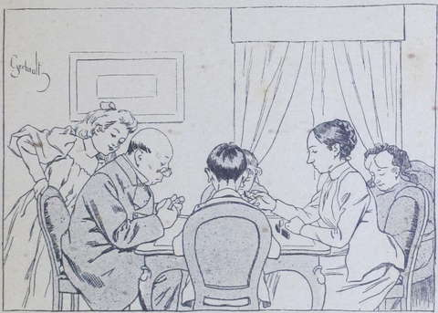
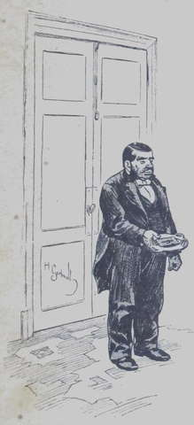
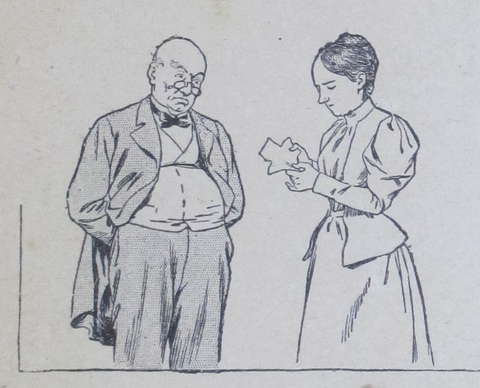

## Garçon manqué

« Tante Anne a bien sommeil, et elle n’ose pas aller se coucher », 
pensa assez judicieusement la petite Suzanne Frézelle dont l’œil caressant 
observait une vieille dame qui somnolait dans un fauteuil.  
Suzanne avait raison : tante Anne eût bien voulu regagner sa chambre et son 
lit, mais elle n’était pas chez elle et attendait que la maîtresse de la 
maison, sa nièce, donnât le signal du repos.  
Une bien jolie vieille que cette bonne tante Anne ! Sa tête grise, qui ne 
tarderait pas à devenir tout à fait blanche, coiffée de dentelle noire, 
débris de la richesse perdue, avait une expression de bonté et d’indulgence 
qui la faisait aimer tout de suite ; et l’on devinait, sous le sourire 
exquis et dans la pâleur éternelle de ce visage ridé, une souffrance 
vaillamment supportée.  
Suzanne, elle, la petite nièce de M^me^ Anne et l’enfant adoptive des 
Harmanay, était une franche gamine de neuf à dix ans, aux yeux bleus rieurs, 
à la chevelure dorée et bouclée, mais toujours coiffée à la diable, parce 
que la toilette était bien le moindre de ses soucis.  
Tout le monde disait d’elle : « C’est un garçon manqué ». Mais 
Suzanne ne s’en offusquait pas, et même elle murmurait, en soupirant, entre 
ses dents blanches :

« Plût à Dieu que je fusse un garçon au lieu d’une fille ! Au moins 
je serais fort, indépendant ; je quitterais la Fauconnière où l’on ne 
m’aime pas, et j’en enlèverais tante Anne qui n’y est pas heureuse ; 
je gagnerais de l’argent pour elle et pour moi, et nous serions bien 
contents. – Mais voilà ! le bon Dieu m’a créée petite fille ! »

Les quatre membres composant la famille Harmanay jouaient en ce moment aux 
dominos : le père, homme faible et indolent, marquait les points et 
conseillait les enfants ; la mère, femme autoritaire et peu aimable, 
admonestait ceux-ci lorsqu’ils dérangeaient maladroitement le jeu, 
l’aîné des jeunes Harmanay, Marcel, était un garçon d’environ quatorze 
ans, laid, maussade et égoïste ; sa sœur Marine, à peu près de l’âge 
de Suzanne Frézelle, n’inspirait guère plus de sympathie ; pourtant cette 
fillette, qui au fond n’était pas méchante, eût été meilleure si 
l’exemple de son frère n’eût paralysé ses bons mouvements et changé ses 
qualités en défauts.

« Gagné ! s’écria tout à coup Suzanne qui, penchée sur l’ardoise, 
avait suivi avec intérêt la fin de la partie. C’est mon oncle et Marine qui 
ont le plus de points ! »

M^me^ Harmanay leva sur sa nièce un œil froid et sévère, et lui dit sur un 
ton courroucé :

« On ne vous demande rien, Suzanne ; de quoi vous mêlez-vous ? Vous 
feriez bien mieux de vous appliquer à votre tricot, que vous avez commencé 
depuis huit jours et qui n’avance guère ! »

La fillette coula un regard malicieux du côté de ses cousins :

« Marcel et Marine ont congé le soir, fit-elle observer ; mais moi, je 
dois travailler même pendant les récréations.  
— Vous n’êtes ni Marcel, ni Marine, répondit M^me^ Harmanay d’un ton 
glacé ; vous l’oubliez souvent, Suzanne, et je vous serai obligée de ne 
pas établir de comparaison entre vous et eux. D’ailleurs, pour vous être 
permis de raisonner ainsi avec moi, votre tante, votre tutrice et votre 
bienfaitrice, vous serez privée de la promenade que nous devons faire demain 
matin au Vieux-Château. »

Suzanne réprima avec peine un mouvement de joie : ah ! qu’elle aimait 
bien mieux ne pas y aller !… au moins elle resterait quelques heures de 
plus avec tante Anne, et en tête-à-tête encore !  
Tante Anne ne pensait pas comme la coupable, sans doute, car elle hochait sa 
vieille tête grise tout attristée ; elle allait parler, intercéder 
probablement pour Suzanne, mais elle referma ses lèvres ridées sans avoir 
proféré un mot : elle se rendit compte à temps que son intervention nuirait 
à l’enfant plus qu’elle ne lui profiterait.

« Va-t-on se coucher, enfin ? » grogna Marcel furieux d’avoir 
été battu aux dominos.  
Et il s’étira et bâilla sans gêne devant tous.  
« Mal élevé… » murmura la petite voix moqueuse de Suzanne à son 
oreille.  
Le jeune garçon s’apprêtait à protester contre ce qualificatif, mais il fut 
interrompu par l’entrée d’un domestique, qui apportait un petit papier 
bleu sur un plateau. L’indolent M. Harmanay prit sans empressement ce petit 
papier bleu, qui était un télégramme annonçant peut-être une fâcheuse 
nouvelle. Plus vive que lui et plus curieuse, sa femme le lui enleva des mains 
et le parcourut des yeux.

« Mon Dieu ! mon Dieu ! il ne nous manquait plus que cela… gémit avec 
un air de profond découragement M^me^ Harmanay en laissant tomber de ses mains 
la malencontreuse dépêche.  
— Qu’est-ce encore ?… Une mauvaise nouvelle ? demanda son mari sans 
quitter son ton nonchalant.

Hors sa femme et ses deux enfants ici présents qu’il savait en sûreté, il 
ne possédait que des parents dont il se souciait fort peu, et il n’avait pas 
un véritable ami ; aussi la curiosité, plus que l’inquiétude, 
dictait-elle cette question.  
Cependant Marcel et Marine s’étaient jetés sur le papier bleu, qu’ils 
déchiffraient tout haut :

« Je vous arriverai mercredi, onze heures matin, avec Lako et un domestique. 
Venons de Bombay. Nous reposons Marseille. »

Le télégramme était signé : « DRAKE ».

« Drake ? Je ne connais pas de Drake. Qu’est-ce que ce Drake qui nous 
arrive comme cela sans dire gare ? demanda Marcel avec quelque dédain.  
— Il dit bien « gare ! » riposta Suzanne, puisqu’il envoie une 
dépêche trente heures à l’avance.

Marcel se contenta de hausser les épaules.

« Ce Drake est une Drake, répondit M. Harmanay qui paraissait songeur. 
Mabel Drake est ma belle-sœur et par conséquent votre tante, mes enfants ; 
elle est veuve depuis quelques années, et je la croyais dans  l’Inde pour le 
reste de ses jours. Je me trompais, puisque la voilà !…  
— Encore une tante ! grogna aimablement Marine sans paraître 
s’apercevoir de la présence de M^me^ Anne. Est-ce qu’elle va rester 
longtemps à la Fauconnière ?  
— Qu’en sais-je ?… dit enfin M^me^ Harmanay, sortant de sa stupeur ; 
tante Drake est si originale, si singulière, si sans-gêne ! Elle est dans 
le cas de s’installer ici pour un an ou deux.  
— Est-elle riche, au moins ?  
M^me^ Harmanay leva les bras au ciel :

« Ah ! bien oui, riche… elle n’a jamais su manœuvrer sa barque : 
elle a épousé dans l’Inde un homme possédant une fortune considérable, je 
ne sais combien de fois millionnaire ; mais, au décès de ce pauvre Drake, 
un procès a été intenté à la veuve par des Anglais parents du défunt, et 
j’ai toujours prédit que cette pauvre Mabel achèverait de se ruiner en 
soutenant les débats du procès.  
— Tiens ! si elle a des droits !… » fit une petite voix indignée, 
celle de Suzanne.

On ne daigna pas relever cette exclamation.

« Et puisque la voilà en France, ajouta amèrement M^me^ Harmanay en rangeant 
les dominos épars sur le tapis de la table, c’est qu’elle n’a pas 
réussi et vient se réfugier au sein du peu de famille qui lui reste. Bien 
agréable pour nous !  
— Qu’est-ce que ce Lako, qu’elle annonce dans son télégramme ? 
demanda Marine. C’est un nom de singe ou de nègre, ça !  
— Lako ? C’est vrai, je n’y songeais plus. Ce doit être son beau-fils, 
l’enfant de son mari, qu’elle a adopté, en femme romanesque qu’elle est.  
— Ah ! bien, ça va être ennuyeux, fit Marcel en fronçant ses sourcils.  
— On avait déjà bien assez de cette sotte de Suzanne », murmura Marine 
entre ses dents.

Suzanne n’entendit pas nettement la réflexion, mais elle la devina, et son 
petit cœur se serra.

« Allons, il faut se coucher ; ces enfants n’en peuvent plus de 
sommeil ; nous nous occuperons demain des chambres de nos hôtes, dit M^me^ 
Harmanay. Marine, Marcel, vite au lit, mes chéris ; dites bonsoir à votre 
père… Ma tante, je vous présente mes devoirs et vous souhaite une bonne 
nuit », ajouta-t-elle en saluant M^me^ Anne qui se levait aussi.

Puis, son regard tomba sur la petite Frézelle qui lui offrait son front à 
baiser :

« Comment ! encore ici, Suzanne ? Il y a une demi-heure que vous devriez 
être couchée.  
— Ma tante, répliqua la fillette d’un ton qu’elle s’efforçait de 
rendre soumis, vous me disiez, il n’y a qu’un instant, de continuer mon 
ouvrage de crochet… »

Les adieux s’échangèrent et l’on se sépara. M. et M^me^ Harmanay 
regagnèrent leur appartement bien clos, confortable et chaud, et, avant de 
s’endormir, ils causèrent longuement, et non sans amertume, du nouvel ennui 
qui leur arrivait.  
C’était beaucoup par égoïsme et un peu par avarice que les Harmanay se 
désolaient ainsi de l’arrivée inopinée de M^me^ Drake et de ses compagnons. 
D’un autre côté, ils ne pouvaient la détourner de son projet de 
s’installer à la Fauconnière, ni lui insinuer d’aller à l’hôtel : ils 
avaient envers la bonne dame de grandes obligations, car jadis elle les avait 
puissamment aidés à établir et à accroître leur fortune aujourd’hui fort 
rondelette.  
Il en était de même pour tante Anne qui, ruinée à présent, ne leur avait 
pas refusé autrefois l’appui de son argent et de ses conseils.  
Et cependant, à l’heure où nous commençons notre histoire, tante Anne 
n’était considérée chez ses neveux que comme une charge, une bouche 
inutile, presque une étrangère gardée par charité.  
Elle ne se plaignait pas, la pauvre sainte femme ; elle ne reprochait pas à 
ces oublieux leur ingratitude, mais sa vieillesse était triste.  
Depuis une année environ, toutefois, un rayon de soleil illuminait cette vie 
mélancolique : Suzanne, « le garçon manqué », la fillette à la tête 
folle mais au cœur d’or, l’orpheline que les Harmanay avaient recueillie, 
non par compassion, mais parce qu’elle était leur pupille, que tout le monde 
savait qu’ils devaient seuls en avoir la garde, et enfin parce que M.   et M^me^ 
Frézelle, morts à peu de distance l’un de l’autre, avaient laissé à leur 
enfant une petite rente de quinze cents francs.  
Suzanne n’éprouvait pas une affection bien vive pour son tuteur et sa 
tutrice ; elle n’était pas gâtée par eux, la pauvre mignonne, mais elle 
n’était pas maltraitée non plus ; seulement ce petit cœur affectueux 
souffrait de ne rencontrer que de l’indifférence chez les parents qu’elle 
eût voulu chérir.  
Quant à Marcel et à Marine, enfants gâtés et égoïstes s’il en fut, ils 
étaient en disputes perpétuelles avec leur cousine, et comme leur papa et 
leur maman leur donnaient toujours raison contre Suzanne, celle-ci les aimait 
d’autant moins qu’elle avait un très juste sentiment de l’équité, et 
que la partialité soulevait, dans son petit cœur vibrant, des tempêtes, 
hélas ! inutiles.  
Par contre, elle adorait sa tante Anne, pauvre vieille femme malheureuse comme 
elle, plus malheureuse encore même, puisqu’elle vivait dans la dépendance 
absolue de ses neveux.  
Suzanne, comme toutes les natures délicates, savait, par une caresse, par une 
attention nouvelle, la dédommager d’une parole aigre proférée par M^me^ 
Harmanay ; elle suppléait souvent à la négligence affectée de la bonne 
chargée du service de la vieille dame. Dans la belle saison, elle 
s’ingéniait à découvrir à celle-ci un coin ombreux et agréable où elle 
lui apportait son fauteuil, son ouvrage et ses lunettes ; en hiver, elle 
renouvelait elle-même la braise de sa chaufferette et allait chercher du bois, 
pour ranimer le feu de tante Anne qu’on oubliait d’entretenir. Telle était 
la vie à la Fauconnière avant l’arrivée des « deux Hindous », comme 
Marcel appelait assez irrévérencieusement ceux qu’on attendait le mercredi 
suivant, à onze heures du matin, selon l’avis du télégramme.  
La Fauconnière était une habitation bourgeoise, assez élégante mais surtout 
confortable, sise à quelques kilomètres de Reims, en pleine Champagne.  
Les Harmanay y passaient même l’hiver, sauf deux mois pendant lesquels ils 
demeuraient à Paris dans un petit pied-à-terre conservé rue Joubert, à la 
grande joie de Marcel et de Marine. Leurs études en souffraient certainement, 
mais leurs parents ne les poussaient pas beaucoup au travail et les laissaient 
s’amuser tant qu’ils le voulaient pendant leur court séjour à Paris.  
Le reste de l’année, un professeur et une institutrice se rendaient trois 
fois par semaine à la Fauconnière pour instruire Marcel, Marine et Suzanne.  
Cette dernière, nous devons l’avouer, n’était pas la plus studieuse des 
trois écoliers, et, si ce n’eût été pour faire plaisir à tante Anne que 
sa paresse affligeait, elle eût souvent mécontenté sérieusement M^lle^ Crest, 
sa maîtresse.  
L’arrivée de M^me^ Drake et de son beau-fils allait forcément amener quelques 
vacances, au moins jusqu’au lundi suivant ; aussi Marcel et Marine 
pardonnaient-ils aux « Hindous » leur brusque irruption, en raison du 
congé qu’ils allaient leur procurer.  
Toute paresseuse qu’elle était, Suzanne ne songeait pas à cela, et, si elle 
n’éprouvait pas d’avance une grande sympathie pour cette tante et cet 
étranger qu’elle n’avait jamais vus, elle se sentait pourtant disposée à 
les aimer et à leur faire bon accueil.

« D’abord, disait la petite fille avec le franc-parler qui lui était 
habituel, M^me^ Drake ne doit pas être aussi…, voyons, comment dire ? aussi 
sèche que tante Harmanay ; elle sera donc d’une agréable compagnie pour 
tante Anne. Son beau-fils, ce Lako, ne peut pas être aussi hargneux que Marcel 
et Marine, donc nous ferons bon ménage ensemble. En vérité, je suis bien 
contente de les voir arriver ! Au moins on s’amusera mieux qu’avec mon 
cousin et ma cousine qui sont très mauvais joueurs et qui veulent toujours 
commander. »
