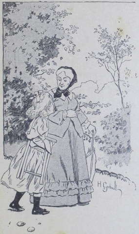
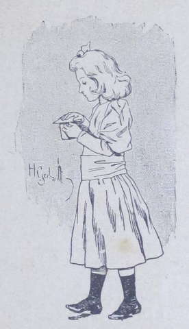
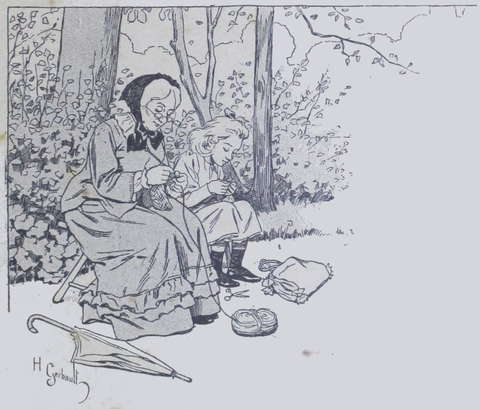

## Une tasse de café noir

« Oui, tante, c’est demain que Mme Drake et son beau-fils Lako 
arrivent ; on leur a arrangé le petit appartement du nord ; vous savez, 
celui qu’on donne aux invités de second ordre, comme dit Marcel ; ma tante 
Harmanay assure que c’est bien assez bon pour eux. Brr ! il n’y auront 
pas chaud en automne, s’ils sont encore à la Fauconnière à cette 
époque ! Moi, si j’étais à la place de ma tante et de mon oncle.... »
Mme Anne interrompit doucement le babillage de la petite fille, qui marchait à 
côté d’elle en portant un pliant et un panier à ouvrage.  
« Ainsi, tu n’éprouves aucun regret, mignonne, d’avoir manqué cette 
partie au Vieux-Château ?... Bien, bien sûr ?  
— Oh ! tante, répondit Suzanne en esquissant une gambade qui compromit 
l’équilibre du panier et du pliant, je suis contente d’être punie !  
— Il ne faut pas dire d’être punie, ma chérie, mais d’être restée 
avec ta pauvre vieille grand’tante. »  
Le petit minois espiègle de Suzanne essaya de prendre un air grave.  
« Mais non, ma tante : je vous assure que j’aime beaucoup mieux votre 
compagnie que celle de... des autres. D’abord, je connais le 
Vieux-Château ; ensuite, tout le long de la route, Marcel et Marine 
m’auraient taquinée ; mon oncle ne m’aurait pas permis de conduire....  
— Je crois bien ! s’exclama tante Anne en riant : pour les faire verser 
dans une ornière ! »  
Suzanne se redressa offensée.  
« Tante, je vous assure que je n’ai jamais fait verser personne : et du 
temps de mon pauvre papa je conduisais très souvent,... seulement il se tenait 
près de moi et ne me quittait pas des yeux. Pour en revenir à la partie 
manquée, nous avons eu au moins le plaisir de déjeuner toutes les deux 
seules, en tête-à-tête ; ah ! c’était gentil, cela !... quoique le 
déjeuner ne fût guère bon. La cuisinière ne s’est pas donné la peine de 
le soigner pour nous, n’est-ce pas, tante ? »  
Mme Anne sourit avec une nuance d’ironie : elle était douce et polie avec 
les domestiques, ne témoignait aucune exigence pour son service, mais sa 
pauvreté l’empêchait de leur faire de temps à autre des cadeaux, de sorte 
que ces gens, qui étaient cupides et intéressés, n’avaient pour elle aucun 
égard.  
« À propos de repas, s’écria tout à coup Suzanne dont la petite tète 
travaillait depuis un moment, on ne vous a pas servi de café aujourd’hui, 
tante ?

— Non, répondit la vieille dame. Après le dessert j’ai attendu un 
instant, croyant que François allait l’apporter, mais comme il n’y avait 
que moi pour en prendre, on n’en aura sans doute pas fait. Oh ! petite, 
qu’importe ? c’est du superflu, cela, et pour une fois... !  
— Pour une fois ! pour une fois ! répéta l’enfant indignée ; 
c’est toujours comme cela quand nous sommes seules à déjeuner, et vous avez 
mal à la tête lorsque votre café vous manque. Oh ! pauvre tante ! vous 
vous figurez qu’ils s’en privent à la cuisine ! Vous pouvez bien être 
persuadée qu’ils se servent le meilleur, allez !  
—— N’importe, fit Mme Anne un peu inquiète du ton agressif de la petite 
fille ; surtout ne dis rien, ne réclame pas ; nous ne sommes pas les 
maîtresses de la Fauconnière, ne l’oublie pas ! »  
Suzanne eut un sourire malicieux ; lorsqu’elles furent arrivées à un 
berceau de feuillage qui tamisait les rayons déjà très chauds d’un soleil 
de fin de mai, la vieille femme et sa gentille compagne s’arrêtèrent. 
L’enfant disposa le siège garni de coussins, ouvrit la corbeille à ouvrage, 
puis, feignant d’avoir oublié quelque chose, prit sa course vers la maison.  
Chemin faisant, elle ne fit attention ni aux fleurs embaumées qui semblaient 
lui sourire et l’appeler, ni au parc alors dans tout son éclat, ni aux 
avances de son ami _Tombola_ qui jappait en mordillant ses jupes courtes, comme 
pour l’inviter au jeu.  
« Tout à l’heure, Tombola ! Je n’ai pas le temps de m’amuser en ce 
moment ; il faut que je travaille pour tante Anne. Tante Anne est trop 
douce ; moi, je vais parler pour elle, je ne veux pas qu’on la traite comme 
la dernière personne de la maison, elle qui en est la meilleure ! »  
Tombola parut comprendre et approuver ce discours, car il cessa de jouer et se 
coucha tranquillement, en attendant que sa petite amie eût rempli sa 
commission.  
Les domestiques de la Fauconnière achevaient en paix leur déjeuner, riant 
très haut et médisant des maîtres absents, lorsque la tête blonde et 
ébouriffée de Suzanne apparut par l’entre-bâillement de la porte.  
« Le café de Mme Anne ? » dit la fillette d’une voix très nette.  
Il y eut un moment de stupeur parmi les gens attablés devant les reliefs 
d’un excellent déjeuner.  
« Il n’y en a pas aujourd’hui », répondit froidement la cuisinière, 
sans se retourner.  
Suzanne ne se déconcerta pas pour si peu : elle entra tout à fait, et, 
résolument, marcha au fourneau, où une cafetière rebondie fumait en exhalant 
un délicieux parfum de moka.  
Elle avait eu soin de passer par l’office et de se munir d’une tasse, 
d’une soucoupe et d’une petite cuillère.
Elle versa le café dans la fine porcelaine où cliquetaient deux morceaux de 
sucre, et, afin de répandre le moins de liquide possible, elle retourna la 
soucoupe sur la tasse. Puis, avec des précautions infinies, majestueuse et 
solennelle comme si elle portait une relique, elle quitta la cuisine et 
s’achemina dehors.

Dans l’opération, elle s’était un peu brûlé le pouce, mais elle 
supportait héroïquement la douleur.  
« C’est pour tante Anne, pensait-elle ; je peux bien souffrir cela pour 
elle ! »  
Arrivée au milieu de sa course, elle regarda avec inquiétude Tombola qui 
venait à elle, de son allure ordinaire, c’est-à-dire avec des gambades 
insensées.  
« Mon Dieu ! se dit-elle, pourvu qu’il ne se jette pas sur moi et ne 
fasse pas renverser ce café que j’ai eu tant de peine à conquérir ! » 
 
Mais Tombola était un chien de tact : en voyant sa petite camarade de jeux 
marcher à pas mesurés, le bras tendu, l’oeil fixe, ses jolies dents de 
nacre enfoncées dans la lèvre inférieure, il réprima ses expansions et 
mesura son allure à la sienne. Pendant ce temps, à la cuisine, les 
serviteurs, rouges de honte, grommelaient contré la fillette.  
Tante Anne se disposait à faire une petite sieste, lorsque à l’entrée de 
la charmille parut la figure rouge et rayonnante de Suzette suivie à distance 
respectueuse par Tombola.  
« Que m’apportes-tu là, ma petite fille ? s’écria la vieille dame en 
bondissant presque de son siège.  
— Votre café, tante Anne, répondit Suzanne avec sang-froid. On avait 
oublié de vous le servir ; aussi je suis allé le chercher. Il ne faut pas 
que vous ayez mal a la tête aujourd’hui, car vous allez me raconter de 
belles histoires, n’est-ce pas ?

— Oui, mignonne. Allons, te remercie ; tu es une petite fille 
attentionnée. Tu vas jouer et courir un moment, car les enfants ont besoin 
d’exercice, et puis tu viendras t’asseoir près de moi. »  
Suzanne obéit ; toujours suivie de Tombola, elle entreprit une course folle 
et se livra à une gymnastique compliquée avec son docile compagnon.  
Trois beures n’étaient pas loin de sonner lorsqu’elle revint au berceau de 
verdure où tante Anne se réveillait après avoir dormi pendant quelques 
instants. Suzanne s’assit sur le gazon, et, avec une moue de déplaisir, prit 
une tapisserie facile à faire, que lui désignait la vieille dame. Tombola 
essoufflé et rompu de fatigue, lui aussi, s’étendit tout de son long à 
côté de sa petite amie, et, la tête appuyée sur ses pattes de devant, 
s’apprêta à faire un somme.  
Tombola se nommait ainsi parce que les Harmanay l’avaient gagné à une 
loterie lorsqu’il était encore tout petit.  
« Ainsi, mignonne, tu veux une histoire ? demanda Mme Anne.  
— Oui, tante, s’il vous plaît. Mais auparavant donnez-moi quelques 
détails sur Mrs Drake et Lako. »  
Mme Anne sourit finement :  
« Elle était bien originale lorsque je l’ai connue, il y a une dizaine 
d’années, reprit-elle, cette bonne Mabel ; en a-t-elle joué des 
tours ! »  
— C’était donc un « garçon manqué » comme moi ? » dit très 
sérieusement la petite Frézelle.  
La tante rit de bon cœur.  
« Non, fillette ; du moins pas il y a dix ans, car elle en avait alors 
déjà quarante ; mais ta tante Drake, qui est ma cousine, a son franc-parler 
comme une Américaine, quoiqu’elle ne soit pourtant qu’à moitié Anglaise. 
 
— Pourquoi _à moitié_, tante Anne ?  
— Elle a vu le jour et a passé toute sa jeunesse sur la terre de France, ma 
chérie, mais sa mère, qui était originaire de Londres, l’a mariée à un 
riche Anglais veuf, établi depuis longtemps dans l’Inde.  
— Ce doit être beau, l’Inde ! soupira Suzanne ; j’aimerais a voir ce 
pays.  
— Tu demanderas à ta tante Drake de te le dépeindre, et aussi à Lako 
qu’elle amène avec elle.  
— C’est un petit garçon, tante Anne ? Est-il gentil, Lako ?  
— Il m’est impossible, ma mignonne, de te donner sur celui-ci le moindre 
renseignement. Je ne l’ai jamais vu et j’ai même oublié quel peut-être 
son âge. Il sera pour moi comme pour toi un inconnu.  
— Pourvu que Marcel et Marine soient aimables pour ce nouveau venu ! 
murmura Suzanne qui avait ses raisons d’en douter. Mon oncle et ma tante 
Harmanay ne les grondent jamais quand ils sont méchants pour vous ou pour moi, 
tante Anne ; ils ne se gêneront donc pas pour maltraiter Lako et même 
peut-être tante Drake. »  
« Pour celle-ci on aura des égards, pensa Mme Anne, car, sans être ce 
qu’on appelle riche, elle paiera au moins aux Harmanay une pension 
suffisante. »  
« Allons, mignonne, dit-elle à haute voix en examinant la tapisserie de 
Suzanne qui n’avançait guère, ne parlons plus de ceux qui vont arriver et 
que tu connaîtras toi-même demain. J’ai une belle histoire à te raconter. 
Écoute-moi bien. »  
Suzanne tendit l’oreille, attentive ; et nous devons avouer que son ouvrage 
n’avança guère plus sous ses petits doigts.
