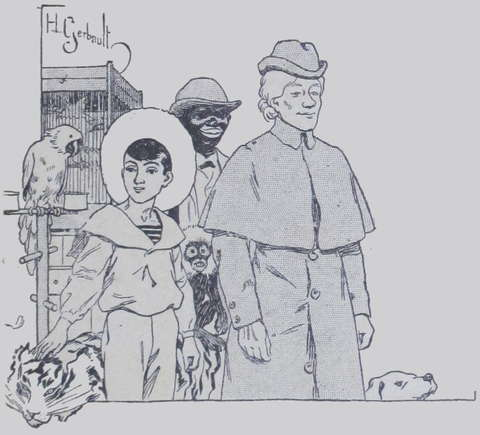
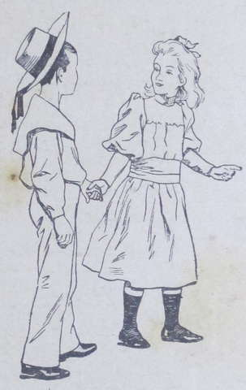
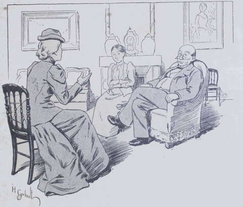
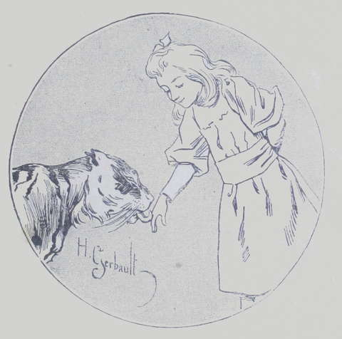

## La ménagerie de tante Drake

L’arrivée de M^me^ Drake fut pour la famille Harmanay une véritable 
catastrophe ! Tout fut bouleversé dans la tranquille demeure de la 
Fauconnière, si peu habituée au bruit et au mouvement.  
En se plaçant au point de vue de leur égoïste amour du calme, M. et M^me^ 
Harmanay avaient eu bien raison en s’effrayant des conséquences qu’allait 
avoir pour eux l’arrivée de leur parente.
M. Harmanay, l’homme paisible par excellence, qui ne se réveillait que pour 
jouer aux dominos, faillit en faire une maladie ; sa femme eut presque la 
jaunisse ; quant à leurs enfants ils n’osèrent formuler tout de suite les 
remarques désagréables qui leur vinrent à l’esprit à l’irruption des 
« Hindous ».  
Ce fut un mémorable après-midi que celui où M^me^ Drake et sa suite 
débarquèrent à la Fauconnière.  
D’une grande berline de voyage comme on n’en rencontre plus guère qu’à 
la campagne et chez certaines gens très retirées, sortit une grande femme aux 
cheveux mi-blonds, mi-argent, au teint encore frais, aux dents longues, aux 
pieds d’une grandeur démesurée, et habillée avec des vêtements étranges 
qui firent éclater de rire Marine et Marcel.  
De ses jupes, plus que des coussins de la voiture, émergea un jeune garçon 
d’une douzaine d’années, qui certes méritait aussi un examen sérieux.  
Il était vraiment beau, cet enfant, quoique d’un teint particulier, avec sa 
pâleur mate, ses cheveux noirs un peu frisés mais non crépus ; avec ses 
yeux sombres d’Oriental, yeux qui étaient très expressifs, et avec sa fine 
bouche pourpre dont le joli sourire franc laissait entrevoir une double ligne 
de dents blanches.  
C’était Lako.  
À côté de lui, surgit tout à coup un singulier petit animal, tenant à la 
fois du chat et du fauve. Sa robe soyeuse et rayée de noir, son mufle rond et 
velouté, sa démarche et l’or limpide de ses prunelles disaient hautement 
son origine.  
Comme cette bête, que Lako tenait d’ailleurs en laisse, avançait çà et 
là sa tête curieuse et inquiétante, le jeune garçon prononça 
impérieusement, en mettant sa main fine et brune sur la fourrure fauve :

« Be quiet, _Sweets-heart_, be quiet ! » Ce qui, en anglais (seule 
langue que parlât le petit étranger), ordonnait à l’animal de demeurer 
tranquille.

« Dieu ! qu’est-ce que cela ? » s’écria M^me^ Harmanay, pâle 
d’effroi, en désignant le groupe qui se tenait en bas du perron.  
M^me^ Drake se retourna :

« Cela, c’est mon beau-fils, mon cher petit Lako ; j’allais vous le 
présenter. Approchez, Lako, mon cher enfant ; venez saluer M^me^ Harmanay, 
notre hôtesse.
— Je veux dire… cet animal », reprit la maîtresse de céans qui 
indiquait _Sweet-heart_.  
Mistress Drake rit bien haut en montrant ses longues dents :

« _Sweet-heart_ ?… (Doux-Cœur), l’amie intime de Lako, une jeune 
tigresse parfaitement apprivoisée et fort bien élevée, qui….  
— Mais je ne veux pas de cette horrible bête sous mon toit ! s’écria 
avec effroi M^me^ Harmanay. Elle nous fera des peurs terribles et pourra mordre 
mes enfants. Je ne puis supporter une tigresse chez moi ! »

Sans se laisser déconcerter, M^me^ Drake haussa légèrement les épaules et 
répondit :

« Je vous répète que vous n’avez rien à craindre ; l’aurais-je 
amenée, sans cela ? et laisserais-je mon petit Lako jouer sans cesse avec 
elle ? D’ailleurs elle ne couchera pas dans votre maison ; mon nègre 
Blanc-Blanc, qui est très habile, lui construira une niche dans la cour. »

Et, passant d’un sujet à un autre avec la volubilité qui semblait la 
caractériser, la bonne dame se dirigea vers tante Anne, qu’elle embrassa 
dans une étreinte affectueuse.

« Cette chère cousine et amie ! quel bonheur de la revoir !… Nous 
nous sommes tant aimées !… Ah ! nous allons renouer les bonnes 
conversations d’autrefois. Tiens ! tiens ! nous avons vieilli, Anne ; 
ma chère, nous n’avons plus nos joues roses ni nos cheveux blonds ; mais 
c’est la loi de nature, et moi aussi je paie mon tribut aux années. »

Puis se retournant :

« Lako, viens ici, mon enfant », dit-elle en anglais.  
Le jeune garçon-obéit et monta les degrés du perron.  
Arrivé devant la vieille dame, il s’inclina, prit sa main ridée et la baisa 
avec respect.  
Tante Anne attirait à elle la petite figure brune et l’embrassa 
maternellement. Lako attacha sur elle son regard velouté : il l’aima dès 
cet instant.  
Puis, les Harmanay, un peu mécontents de voir qu’on s’occupait de tante 
Anne, firent entrer leurs hôtes dans la maison, tandis que Blanc-Blanc, un 
nègre du plus beau noir, dont le râtelier éblouissant illuminait la face 
noire, déchargeait le char aux bagages, et, aidé du valet de chambre de la 
Fauconnière, disposait malles et caisses dans le vestibule.  
La petite tigresse, qu’on avait fait coucher à la porte, attendait 
docilement le bon plaisir de ses maîtres.  
Successivement prirent place dans le vaste hall, à côté des colis 
inanimés : de mignons inséparables et de frêles bengalis dans une cage de 
voyage ; un perroquet qui criait à tue-tête : « Donnez le déjeuner à 
Fanfan ; Fanfan a faim, très faim ! » puis un joli chien, _Kiss_, et un 
singe à l’air malicieux qui répondait au nom de _Romulus_.  
Sauf la tigresse et Kiss qui avaient pour maître Lako, toute cette ménagerie 
appartenait à M^me^ Drake ; encore avait-elle dû sacrifier une partie de ses 
chers animaux en quittant l’Inde, et avait-elle eu la douleur d’en perdre 
quelques autres pendant la traversée.  
Tandis que les grandes personnes causaient ensemble au salon où tante Drake 
s’était débarrassée de son manteau et de ses longs voiles, Suzanne se 
rapprochait tout doucement de Lako resté un peu en arrière et assez triste en 
apparence.  
Marcel et Marine, que les lois de l’hospitalité la plus élémentaire 
obligeaient à s’occuper de lui, le considéraient d’un œil curieux et 
malveillant.

« C’est un mulâtre, dis ? glissa la petite fille à l’oreille de son 
frère.  
— Parbleu ! répondit celui-ci avec dédain, que veux-tu donc qu’il soit 
avec cette figure de pain d’épice ? »

Marine se mit à ricaner :

« Pain d’épice, c’est bien vrai !… quel drôle de petit 
moricaud ! »

Suzanne, qui avait l’ouïe fine, entendit ce colloque et jeta un regard 
mécontent à ses cousins.  
Le pauvre Lako semblait fort malheureux ; tout à coup il se retourna ; on 
prononçait son nom, et une petite main souple et douce se glissait entre ses 
doigts bruns :

« C’est vous qui êtes Lako, n’est-ce pas ? » lui demandait Suzanne.  
Il ne comprenait pas, mais il sourit à la vue de la jolie fillette qui le 
considérait de ses yeux bleus caressants, et qui secouait sur ses épaules 
mignonnes une longue natte de cheveux blonds.

« Lako, répéta-t-il, yes, Lako. »

Suzanne lui adressa encore plusieurs questions, mais il ne comprenait pas 
davantage.  
Par bonheur pour eux, M^me^ Drake s’aperçut de leur manège désespéré.

« Ah ! mignonne, dit-elle en riant ; tu es bien gentille pour Lako, mais 
il ne comprend encore que l’anglais, et tu n’as pas l’air de connaître 
cette langue. Bah ! les enfants se tirent toujours d’affaire ; dans 
quelques jours je suis sûre qu’ils bavarderont comme deux perruches. »

Voyant l’insuccès de ses avances et s’apercevant que Lako ne comprenait 
pas un mot de ce qu’elle disait, Suzanne se dressa un peu sur la pointe
des pieds, et approchant ses lèvres de la joue brune du petit étranger,
elle lui donna un baiser, que l’enfant lui  rendit avec un sourire
reconnaissant.  

« C’est bien ; je vois qu’ils seront bons amis », murmura M^me^ Drake 
avec satisfaction.  
Puis se tournant vers M^me^ Anne qui regardait aussi avec amour sa petite nièce, 
l’enfant de son cœur, elle ajouta : « N’est-ce pas, cette blondine est 
la fille de notre pauvre Jeanne, Jeanne Frézelle ? Elle est ma nièce, par 
conséquent. J’en suis bien aise. Appelez-la donc. »

Tante Anne fit un signe et Suzanne vint offrir son joli front aux larges 
lèvres de sa nouvelle tante.

« Celle-ci, je l’aime déjà, dit cette dernière qui ne savait jamais 
voiler sa pensée, et d’autant plus qu’elle se montre bonne pour mon petit 
Lako. »

Suzanne Frézelle leva ses yeux clairs sur M^me^ Drake et prononça sans 
hésitation :

« Moi aussi, je vous aime déjà, ma tante, mais pas autant que tante Anne, 
que je chéris plus que tout au monde ; et n’ayez pas peur, je protégerai 
Lako, vous verrez.  
— Ah ! ah ! fit l’Anglaise en riant, ce sont les rôles renversés 
ici : les fillettes protègent les garçonnets ?  
— Eh ! ma tante, riposta gravement Suzanne, je sais bien que je suis plus 
jeune et moins forte que Lako ; mais il est nouveau et ne connaît encore 
personne ici. Et puis… »

Elle s’arrêta, et ses yeux se dirigèrent machinalement vers le groupe 
maussade formé par Marcel et Marine ; mais elle n’osa pas formuler plus 
clairement sa pensée.

« Allons, enfants, allez jouer, et occupez-vous un peu de votre petit 
ami ! » dit tante Anne qui craignait avec raison que Suzanne n’exprimât 
ses idées avec trop d’expansion.  
Suzanne prit Lako par la main et l’emmena dehors en attendant que le goûter 
fût servi ; Marcel et Marine les suivirent en chuchotant d’un air moqueur.

Dans la crainte que M. et M^me^ Harmanay, un peu délaissés par M^me^ Drake, ne 
s’en montrassent froissés, M^me^ Anne se leva, sous prétexte d’aller 
veiller aux bagages des arrivants, et M^me^ Drake, son beau-frère et M^me^ 
Harmanay restèrent ensemble.  
Quand la conversation eut roulé un instant sur le voyage et la traversée, les 
maîtres de la Fauconnière hasardèrent quelques timides questions sur les 
_affaires_ de Mrs Drake.  
L’Anglaise leva au ciel ses grands bras.

« Ah ! mes chers amis ! s’écria-t-elle, ne m’en parlez pas ! Ce 
procès est toujours en suspens, et je crois bien qu’il me faudra renoncer à 
disputer à mes adversaires ma fortune et celle de Lako.  
— Alors… vous arrivez… ruinée ?… » demanda M^me^ Harmanay d’une 
voix dont l’altération n’échappa point à M^me^ Drake. Elle retint un 
sourire malicieux.

« Ruinée,… pas totalement, Dieu merci ! J’ai de quoi subvenir aux 
frais que notre séjour à la Fauconnière vous occasionnera ; mais cependant 
l’avenir n’est pas, pour nous, couleur de rose…  
— Pourquoi avez-vous quitté l’Inde ?  
— Ah ! voilà ; l’éducation de Lako….  
— L’éducation de ces enfants de…, d’Indiens, permettez-moi de vous le 
faire observer, Mabel, n’est pas poussée très loin, en général.  
— En général, soit, riposta vivement Mrs Drake ; mais il me plaît de 
soigner celle de mon beau-fils, que je considère absolument comme mon enfant. 
D’ailleurs vous ne savez pas de quelle intelligence il est doué ; ensuite 
remarquez que ce n’est pas un Indien, comme vous le dites, pas même un 
mulâtre, malgré la couleur brune de sa peau, mais le fils de mon mari qui 
était Anglais ; quant à sa mère, elle était Portugaise. »

Les Harmanay firent un mouvement qui signifiait : « Que nous 
importe ! » puis l’entretien roula sur tante Anne et sur la petite 
Frézelle.  
La grand’tante et la petite nièce ne furent guère épargnées par la peu 
charitable M^me^ Harmanay :

« Certes c’était une bien lourde charge que cette pauvre femme ! Elle 
était très exigeante, difficile à vivre, toujours triste, et elle se 
plaignait sans cesse.  
« Puis, Suzanne était désobéissante, impertinente, paresseuse, taquine 
pour ses cousins », etc., etc.  
« Bon ! » se dit Mrs Drake en se levant pour passer dans la salle à 
manger, car on venait de sonner le thé ; « je ne me fie pas du tout au 
jugement de mon beau-frère et encore moins à celui de sa femme. J’ai 
toujours connu Anne douce, bonne et résignée : je serais bien surprise si 
elle était devenue acariâtre. Quant à la fillette qu’on me dépeint comme 
un véritable petit monstre, elle m’a semblé franche et aimante autant que 
jolie. J’observerai tout cela par moi-même, et, ou je me trompe fort, ou je 
crois fermement que tante Anne et Suzette Frézelle valent mille fois mieux 
chacune que tous les Harmanay ensemble. »

Comme on appelait la jeune bande pour le lunch, Suzanne entra, le teint animé, 
les yeux brillants, le bras passé sous celui de son nouvel ami Lako qui 
l’accompagnait, plus calme, plus froid en apparence, mais souriant aussi.  
En prenant place a table, à côté de Mrs Drake, il se pencha vers elle et lui 
dit en anglais :

« Mère, elle est bonne pour moi, et je l’aime bien.  
— Qui cela ? fit l’Anglaise avec malice.  
— Suzanne.  
— Et les autres ? »

Le petit garçon serra les lèvres et ne répondit pas.  
De fait, il n’avait pas à se louer de Marcel et de Marine : ceux-ci avaient 
continué à le regarder d’une manière impertinente et dédaigneuse, 
affectant de se tenir à distance et ne le désignant que sous le sobriquet de 
_Pain d’épice_, faisant ainsi allusion à la couleur brune de sa peau.  
L’enfant, nous le savons, n’était cependant pas mulâtre, mais son teint 
s’était doré sous les rayons d’un soleil plus chaud que celui de nos 
pays.  
D’abord Suzanne s’était fâchée contre ses cousins, dont elle devinait la 
sourde hostilité à l’égard du petit étranger.

« Je vous défends de l’appeler Pain d’épice ! » s’était-elle 
écriée.  
Mais, haussant les épaules, Marcel et Marine avaient redoublé méchamment 
leurs vilaines moqueries, dont une grande partie était dirigée contre leur 
cousine.

« Vous êtes méchants et lâches, continuait celle-ci. C’est vilain de 
railler un hôte que vous devriez recevoir au moins poliment. »

Lako ne comprenait ni les aigres paroles qui s’échangeaient autour de lui, 
ni que sa petite amie Suzanne le défendait.  
Le lunch terminé, les voyageurs montèrent dans leur appartement ; puis, 
aidés du nègre Blanc-Blanc, ils vidèrent leurs malles et disposèrent avec 
soin leurs effets dans les tiroirs des meubles qui leur étaient réservés.  
Vers le soir, Lako et Suzanne redescendirent dans la cour et allèrent trouver 
la tigresse Sweet-heart qui, un peu étonnée d’un tel déplacement, se 
tenait tranquillement couchée et léchait avec soin ses pattes de velours dont 
on avait pris le soin prudent de rogner les griffes naissantes.  
Suzanne, qui n’avait peur de rien, la caressa tout comme s’il se fût agi 
d’un chat au lieu d’une petite tigresse, et la jolie bête, flairant en la 
fillette une alliée pour son maître et pour elle, passa sa grande langue rose 
et rugueuse sur les petites mains de cette nouvelle amie.

« Celle-ci, il faudra l’aimer comme moi », dit le jeune garçon à la 
tigresse dans sa langue familière.  
Peut-être Sweet-heart comprit-elle ce que lui disait son petit maître, car 
elle témoigna dès ce jour un attachement très fidèle à la petite 
Frézelle.  
Pour cette première nuit, on concéda une niche provisoire à Sweet-heart, qui 
y fut enchaînée et enfermée par les soins de Lako et de Suzanne aidés de 
Blanc-Blanc.  
La fillette s’assura de même que le nègre, auquel personne ne songeait, 
était bien installé et avait tout ce qui lui était nécessaire dans sa 
chambrette située sous les toits ; le singe eut un biscuit, le chien une 
bonne soupe, et les oiseaux de diverses couleurs formant la ménagerie de tante 
Drake s’endormirent tranquillement, la tête sous l’aile.  
D’ailleurs on était aux premiers jours de juin : la nuit était douce, la 
brise tiède, le ciel limpide, et tous les voyageurs firent des songes 
paisibles.  
Seule Suzanne rêva que Sweet-heart était changée en une jeune personne fort 
bien élevée, tandis que Marcel et Marine prenaient la forme d’un tigre et 
d’une tigresse.
