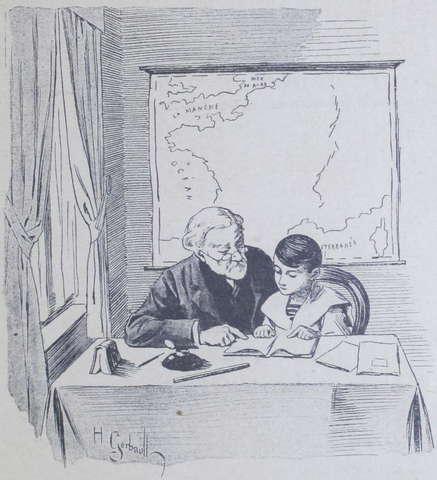

## La boîte longue

Il y a un mois que Mrs Drake et sa ménagerie, comme le dit assez 
irrévérencieusement Marcel Harmanay, ont élu domicile à la Fauconnière.  
Le nègre Blanc-Blanc assure que la France est un superbe pays.  
La tigresse Sweet-heart n’en dit pas autant, et pour cause, mais, en personne 
de tact, elle semble se plaire en Champagne, et nul n’a à se plaindre 
d’elle.  
Le chien Kiss est un philosophe qui sait se plier aux circonstances de la vie 
et entrer dans les bonnes grâces de tout le monde.  
Le singe Romulus pense, à part lui, que dans sa patrie il jouait au milieu de 
plus beaux arbres et croquait de meilleurs fruits ; mais il n’exprime pas ses 
regrets et s’est pris de vive amitié pour Tombola qui le réchauffe entre 
ses grosses pattes pendant les nuits trop fraîches.  
Le perroquet Fanfan a bien reçu quelques admonestations pour avoir crié à 
l’oreille de Marcel :

« Oh ! qu’il est laid ! qu’il est laid ! qu’il est laid ! » 
ce qui a violemment irrité le jeune garçon ; mais Suzanne et Lako ont 
consolé Fanfan, et il fait maintenant la joie des domestiques, qui lui 
apprennent toutes sortes de phrases amusantes.  
Quant aux oiseaux, ils ont du soleil, des insectes, des graines et leur 
affection mutuelle : ils sont heureux.  
Pourtant, comme le bonheur parfait n’existe pas en ce bas monde, il y a bien 
quelques nuages dans la vie des nouveaux hôtes de la Fauconnière.  
Ainsi, le nègre Blanc-Blanc est souvent en butte aux railleries des 
serviteurs : on lui joue de méchants tours, on le plaisante trop fréquemment 
sur la couleur de sa peau ; il ne se fâche pas beaucoup et ne se formalise 
pas longtemps, car il se sait protégé par sa maîtresse.  
Mrs Drake n’a qu’un mot à prononcer, un regard sévère à jeter, pour 
faire rentrer sous terre ces malotrus.  
Sweet-heart a été frappée plusieurs fois (mais de loin, car les agresseurs 
sont poltrons) par Marcel et Marine qui ne se montrent pas bons, en général, 
pour les animaux.

La brave bête contient sa rancune, car Lako, son petit maître chéri, lui a 
fait la leçon et recommandé la patience.  
Quand on n’est pas chez soi, il faut boire en silence quelques affronts.  
Il en est de même du singe, du chien et des perruches ; moins endurant que 
les autres, le premier avait riposté un beau jour, égratigné le visage de 
Marcel et tiré les cheveux de Marine.  
Pour ce bel exploit on l’avait mis aux fers durant vingt-quatre heures, mais 
Suzanne et Lako, trouvant moyen de venir consoler le captif, lui avaient 
apporté leur dessert.  
Lako et tante Drake régnaient en souverains sur toute cette petite troupe.  
Avec tante Anne et Suzanne Frézelle, ils formaient un quatuor ami et faisaient 
un peu bande à part, ce qui irritait sourdement les Harmanay.  
Ceux-ci, toujours égoïstes et désagréables, subissaient la présence de 
l’Anglaise, de son beau-fils et de « la ménagerie », parce qu’ils 
savaient que cet état de choses n’aurait qu’un temps et que, aussitôt 
l’hiver venu, Mrs Drake se rendrait à Paris où Lako entrerait au collège.  
Et puis, en vérité on la craignait un peu, cette tante Drake qui ne cachait 
jamais sa pensée et disait son fait à chacun avec un flegme imperturbable.  
C’était une nature large et décidée, aimant ses coudées franches ; une 
femme prompte à la réplique et toujours occupée.  
Elle allait par grandes enjambées et parlait sans fleurir son style de phrases 
inutiles, comme quelqu’un qui a trop à faire pour se soucier des élégances 
de la vie.  
Bonne, généreuse et droite, elle imposait aux poltrons et intimidait les 
menteurs.  
Suzanne et Mrs Drake s’étaient plu tout de suite, comme on l’a vu, et leur 
affection ne faisait que s’accroître, à la très grande joie de tante Anne.  
L’Anglaise pardonnait à la fillette sa fougue gamine et son étourderie en 
raison de sa franchise et de la bonté de son cœur.  
En quelques semaines, Lako, qui avait une intelligence peu commune, apprit 
assez de français pour se faire comprendre.  
Plus paresseuse, Suzanne avait cependant fait un effort et retenu un peu 
d’anglais, afin de répondre quelquefois à son petit ami dans sa langue 
maternelle.  
Mais elle avait en vain essayé de prononcer celle de Blanc-Blanc, dont les 
dents blanches se montraient dans un sourire épanoui chaque fois que la 
fillette tentait de se rappeler une courte phrase de cette langue ; ces sons 
gutturaux semblaient écorcher sa jolie bouche et elle se contentait alors de 
dire en anglais ce qu’elle voulait exprimer.  
Pauvre Lako ! il n’eût pas été très heureux à la Fauconnière sans sa 
petite amie Suzanne. Sa belle-mère était trop occupée pour lui tenir souvent 
compagnie, car elle était obligée de se rendre fréquemment à Paris pour 
affaires.
Marcel et Marine étaient toujours méchants pour leur jeune cousin ; ils 
continuaient à l’appeler _Pain d’épice_, sobriquet que Lako comprenait 
maintenant, et ils avaient toujours des réflexions désagréables à échanger 
à son sujet.  
M. Quinot, le professeur du jeune Harmanay, eut en Lako un élève de plus, et 
surtout un élève dont les progrès rapides le consolaient de la paresse de 
Marcel.  
Au lycée de Paris où sa belle-mère avait l’intention de l’envoyer 
l’hiver suivant, Lako lui ferait certainement honneur.  
À la vue de son application et de ses succès, Suzanne eut bientôt honte de 
sa nonchalance et de son ignorance, et elle s’efforça de devenir studieuse 
et appliquée.

« Je ne comprends pas que tu sois si paresseuse, lui disait un jour Lako 
avec un bon sourire corrigeant la sévérité de cette parole ; la paresse 
est un si vilain défaut, et, à part cela, tu es si gentille.  
— Oh ! va, Marcel et Marine sont joliment paresseux aussi, répliqua la 
fillette qui baissait le nez avec humilité.  
— Vas-tu te comparer à eux ? Veux-tu leur ressembler, toi qui es meilleure 
qu’eux ?
— Oh ! non, Lako, répondit Suzette d’une voix douce. Mais c’est si 
ennuyeux de conjuguer des verbes et d’étudier la chronologie pendant que le 
soleil brille, que les oiseaux chantent et que Sweet-heart se roule sur le 
sable doré de la terrasse avec les chiens et l’ami Romulus !

Lako leva imperceptiblement les épaules et sourit.

« Il y a temps pour tout, ma petite Susy, et je t’assure que je joue de 
meilleur cœur, moi, lorsque j’ai bien travaillé.  
— C’est vrai, murmura la fillette songeuse, je suis toujours mal à 
l’aise quand j’ai été paresseuse : cela fait tant de peine à tante 
Anne !  
— Et tante Anne est si bonne ! ajouta le jeune garçon. Si j’étais à ta 
place, moi, Suzette, je sais bien ce que je ferais.  
— Quoi donc ?  
— Je deviendrais très instruite. Écoute, nous autres, Anglais, nous sommes 
des gens pratiques : maman (il appelait toujours ainsi sa belle-mère) maman 
ne m’a pas caché que tante Anne est tout à fait pauvre, que toi tu n’as 
pas grand’chose, ma Susy ; et maman et moi, qui étions riches jadis, nous 
ne savons où va notre fortune avec tous les procès qu’il faut soutenir.  
— Où veux-tu en venir avec cela ?  
— Mon idée, à moi, est de devenir, très vite savant pour gagner de 
l’argent ensuite et faire vivre ma chère maman. À ta place, je te le 
répète, j’en ferais autant, et, une fois grande, je retirerais d’ici 
tante Anne et je gagnerais sa vie avec la mienne par mon travail. »

Suzanne réfléchit un instant, puis elle sauta de joie.

« Ce sera dur, ce sera difficile ! s’écria-t-elle, mais tu as raison : 
il faut faire cela. Oh ! mon Lako, que tu as une bonne idée et que je 
regrette le temps perdu ! Mais je vais vite le rattraper, et désormais M^lle^ 
Crest sera contente de moi. »

Suzanne tint parole ; les deux enfants exposèrent leurs plans à tante Anne 
qui, nous n’avons pas besoin de le dire, les approuva.
Un jour, tante Anne fit toutes ses confidences à Mrs Drake. Elle n’était 
pas heureuse à la Fauconnière. Et puis elle vieillissait, et elle 
s’inquiétait de ce que deviendrait sa pauvre petite Suzanne.

« Il ne faut désespérer de rien », lui répondit tante Drake qui se 
leva et se mit à arpenter la chambre à grands pas, ce qui était sa manière 
à elle d’exprimer son émotion. « Mes affaires de succession ne sont pas 
terminées, et je puis avoir la chance de gagner mon procès. Après tout, Lako 
et moi, nous avons des droits véritables et nous pouvons être dix fois 
millionnaires un jour ; mais que peuvent une faible femme et un enfant contre 
des hommes habiles et sans conscience ? Cependant, ma bonne Anne, nous 
pouvons encore voir de beaux jours. Quant à moi, je lutterai jusqu’au bout 
pour défendre mon bien et celui de mon petit Lako.  
— Mais, de si loin, comment pouvez-vous lutter avec quelque espoir de 
succès, Mabel ? Je crains bien que vous ne puissiez obtenir justice ! »

M^me^ Drake revint s’asseoir près de sa vieille compagne.

« Voici ce que je n’ai dit à personne encore, Anne, répondit-elle. Je 
serai sans doute obligée de repartir pour Bombay dans quelques mois…  
— Alors pourquoi êtes-vous venue en France ? demanda tante Anne.  
— Tout simplement pour mettre mon beau-fils en sûreté, car me méfie de 
ceux qui l’entouraient là-bas, dans l’Inde, où les animaux malfaisants ne 
sont pas seulement les tigres et les reptiles. J’ai pris pour prétexte son 
éducation qui ne pouvait être menée à bonne fin qu’en France. Mais gardez 
le silence sur tout ceci, Anne, je vous en prie ; Lako lui-même n’en 
sait rien, et je ne le lui apprendrai que lorsqu’il sera au collège ; là, 
les études le distrairont forcément de son chagrin.  
— Ah ! pauvre amie ! combien la vie est difficile ! » soupira tante 
Anne en reprenant son tricot un instant abandonné.

M^me^ Drake alla préparer une valise afin de se disposer a partir pour Paris, 
où ses affaires devaient la retenir pendant quelques jours.  
À son retour, elle apporta une jolie robe à Suzanne, un bon châle à tante 
Anne, des bonbons exquis aux jeunes Harmanay, et une potiche à leurs parents. 
Blanc-Blanc ne fut pas oublié et poussa un cri de joie en recevant une 
chaîne de montre en doublé ; comme tous les nègres, il aimait le 
clinquant.  
Quant à Lako, il prit des mains de sa belle-mère une boîte de forme 
allongée dont la vue fit étinceler de joie ses yeux noirs.

« Il est réparé et tout à fait bon, lui dit M^me^ Drake. Pauvre petit ! 
il y a longtemps que cela te manquait.  
— Qu’est-ce donc ? demanda la curieuse Suzanne en désignant la boîte.  
— Tu verras », répondit simplement Lako. qui courut s’enfermer dans sa 
chambre.

Environ une demi-heure plus tard, les fillettes, qui prenaient leur leçon avec 
M^lle^ Crest, levèrent toutes les deux la tête et tendirent l’oreille avec 
surprise : un son très doux, un chant d’une harmonie incomparable vibrait 
dans toute la maison.

« Tiens, qui est-ce qui joue du violon ? demanda Marine étonnée.  
— Tais-toi donc et écoute ! » répondit Suzanne en la poussant du 
coude.

M^lle^ Crest, elle-même sous le charme, prêtait l’oreille.  
Quand les accords s’éteignirent, elle demanda à Marine :

« C’est sans doute votre père qui joue ? »

Suzanne répondit en souriant :

« Mon oncle ? ah ! bien oui ! il abhorre la musique. C’est Lako !  
— Allons donc ! Lako, toujours ton Lako, ce Pain d’épice ! répliqua 
Marine irritée par la remarque inconsidérée de sa cousine. Comment veux-tu 
qu’il sache si bien jouer du violon ?  
— Lako peut tout ce qu’il veut, et sait bien des choses, riposta la 
fillette qui s’échauffait. D’ailleurs je vais avoir la preuve que c’est 
bien lui. »

Et, d’un bond, avant que M^lle^ Crest eût pu la retenir, Suzanne gagnait la 
porte, franchissait le corridor, montait l’escalier et entrait comme une 
bombe dans la chambre où Lako rajustait une corde à son violon.

« C’est toi, Lako, c’est toi ! Je savais bien que ça ne pouvait être 
que toi ! s’écria-t-elle. Oh ! tu es un grand musicien !  
— Non, Suzanne, mais j’en deviendrai un ! répondit le jeune garçon, un 
peu étourdi par cette brusque irruption. J’aime tant la musique !  
— Pourquoi ne me disais-tu pas que tu joues du violon ?  
— J’attendais que maman me rapportât mon instrument de Paris, où il 
était en réparation. »

Lako sourit, puis, soudain inquiet :

« Mais ce n’est donc pas l’heure de ta leçon avec M^lle^ Crest ? »

Suzanne baissa la tête.

« C’est vrai, je vais être bien grondée : j’ai quitté la classe pour 
venir m’assurer que c’est toi qui jouais.  
— Oh ! Suzanne, va-t’en vite ! Désormais je ne ferai jamais de 
musique : au moment de ton travail. »

Suzanne allait se récrier, mais, tout en gagnant la porte, elle dit, après 
une seconde de réflexion :

« Eh bien, tu as raison : ne joue jamais pendant que j’étudie, car je 
n’écouterais que toi ! »

Selon ses prévisions, la fillette fut grondée quand elle rentra dans la salle 
d’étude, mais elle reçut sa punition avec humilité, car elle comprenait 
qu’elle l’avait bien méritée en quittant la classe brusquement, sans 
l’autorisation de sa maîtresse.  
À dîner, comme elle était privée de dessert, Lako voulut partager ses 
fruits avec elle.

« Non, lui répondit-elle résolument. Je ne mérite pas d’en avoir 
aujourd’hui. Seulement, si tu veux me dédommager, Lako, tu me feras de la 
musique ce soir avant que je me couche. »

Vous devinez que Lako ne refusa pas de lui faire plaisir, et il lui joua ses 
airs préférés pendant une grande heure.  
Cet enfant, singulièrement doué sous le rapport des dispositions musicales, 
savait retrouver sous l’archet les mélodies mélancoliques et rêveuses de 
son pays de soleil.  
Il semblait chanter ainsi le ciel aux tons de pourpre, de topaze, d’azur ; 
le soleil de feu ; les forêts sombres où rugissent les fauves ; les 
plaines sans fin dévorées par la chaleur ; la mer indigo qui berce les 
alligators en même temps que les jonques peuplées de couples rieurs ; et 
jusqu’aux terribles tempêtes des équinoxes.  
Ainsi jouant et rêvant tout ensemble, Lako avait l’air d’un exilé qui 
pleure sa patrie absente et les nuits radieuses d’une terre admirable.  
À mesure que le jeune étranger s’exprimait mieux en français, il parlait 
à sa petite amie de cette contrée féerique, où l’Européen 
s’émerveille, mais souvent meurt brûlé de fièvre, et Suzanne finissait 
par le connaître un peu, cet Hindoustan qu’elle eût bien voulu voir.  
Quand le violon se tut, la fillette leva sur le musicien ses yeux bleus 
enfoncés sous les cils châtains ; ils étaient pleins de larmes.

« Tu regrettes ton pays, n’est-ce pas, Lako ? lui dit-elle.  
— Non, Susy, je ne regrette plus rien et je me trouve bien ici. Et puis, à 
Paris, je prendrai des leçons d’un grand professeur et je deviendrai un 
artiste. Maman l’a dit. Oh ! j’aime tant la musique ! »

Des voix grondeuses appelaient Suzanne ; elle dut obéir et aller se coucher.  
Depuis ce jour, à la Fauconnière on entendit souvent un murmure lointain et 
harmonieux, parfois triste, parfois joyeux, qui provenait du violon de Lako ; 
le jeune garçon jouait chez lui, ou dehors sous les ombrages touffus du parc, 
et tous, maîtres et domestiques, suspendaient leurs occupations pour 
l’écouter.  
Mrs Drake, en sa qualité d’Anglaise, ne goûtait pas beaucoup ces mélodies, 
mais tante Anne, au contraire, y prenait un plaisir infini, et ce fut 
désormais une des joies de la pauvre vieille dame qui d’ordinaire avait si 
peu de distractions.
