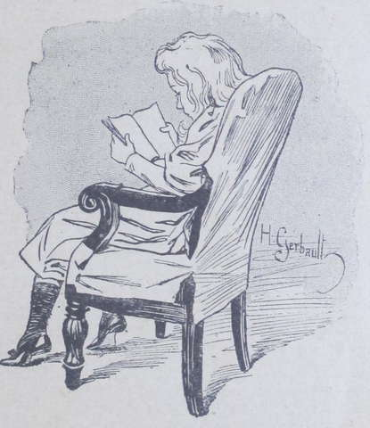
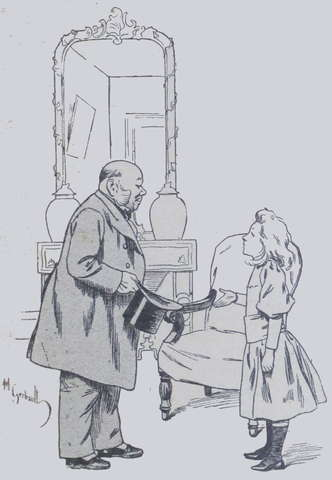
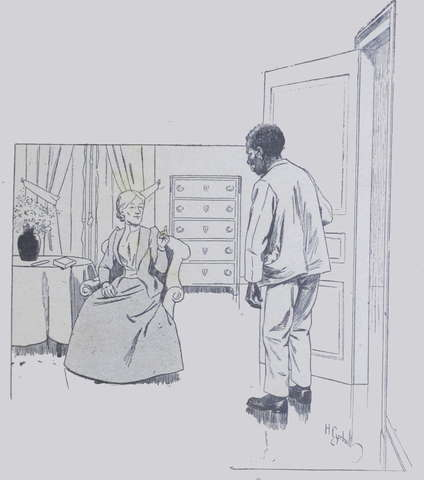
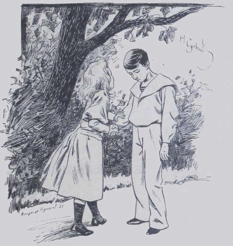

## Ce qu'apportait le gros monsieur décoré

On faisait une petite réparation à la salle d'étude, et Suzanne, condamnée 
à apprendre une leçon de géographie pendant que ses cousins s'amusaient au 
fond du parc, étudiait au petit salon, assise dans un gigantesque fauteuil.  
Tout à coup un domestique ouvrit la porte, et, sans voir la petite Frézelle, 
s'effaça devant un homme d'une corpulence respectable qui entra en soufflant 
comme un asthmatique.

« Je vais prévenir Madame », dit-il.

Et il referma la porte.  
D'un bond, Suzanne fut sur ses pieds, et examinant curieusement le visiteur :

« Est-ce ma tante Harmanay que vous voulez voir, Monsieur ?  
- Non, ma mignonne, je viens pour affaires, et...  
- C'est mon oncle, alors, qu'il vous faut ?  
- Ce n'est ni M. ni Mme Harmanay que je désire voir, ma petite fille, 
répondit l'inconnu amusé par ce babillage.  
- Alors c'est tante Anne ? Vous ne venez pas lui annoncer une mauvaise 
nouvelle, au moins ? Pauvre tante Anne ! elle a toujours peur des lettres 
et...  
- C'est Mme Drake que je demande. »

Le visage de Suzanne s'éclaira.

« Tante Drake ? ah ! Asseyez-vous donc, monsieur ; tante Drake est 
allée jusqu'au village, mais elle ne tardera pas à revenir. Si vous voulez, 
en attendant, je vous tiendrai compagnie.  
- Mais très volontiers, répondit le vieux monsieur, qui s'assit, tandis que 
Suzanne se renfonçait dans son fauteuil.  
- Vous ne venez pas lui apprendre une mauvaise nouvelle, je pense ? fit tout 
à coup la petite fille avec anxiété.  
- Eh ! eh ! je n'en sais rien. L'aimez-vous beaucoup, votre tante Drake ?  
- Beaucoup... Pas tout à fait autant que tante Anne, mais un million de fois 
plus que tante Harmanay.  
- Et si je venais vous l'enlever ?  
- L'enlever, tante Drake ? et alors Lako aussi ? Oh ! monsieur ! 
monsieur ! que me dites-vous là ? »

Le visiteur se mordit les lèvres à la vue du petit visage soudain pâli, 
troublé par ses dernières paroles.

« J'ai trop parlé ! murmura-t-il. La mignonne est impressionnable. Je 
plaisante, ajouta-t-il tout haut ; ne pensez plus à cela. »

Suzanne se rasséréna ; puis, apercevant par la fenêtre Mrs Drake qui 
s'avançait à grandes enjambées dans l'avenue, elle s'écria :

« Voici ma tante ! Je vais lui apprendre que vous êtes là, car je une 
sais pas si on l'a prévenue. »

Elle disparut par la porte-fenêtre ouvrant sur le perron et rejoignit la bonne 
dame, qui n'était plus qu'à une cinquantaine de mètres de la maison.

« Tante, lui dit-elle très gravement, il y a au salon un monsieur qui vous 
attend.  
- Un monsieur... qui m'attend, moi ?  
- Oui, tante ; il est assez vieux, assez gros, assez rouge ; il a un grand 
nez, de petits yeux, beaucoup de mentons, le ruban de la Légion d'honneur et 
du coton dans les oreilles.  
- Ah ! fit la tante sans sourciller ; ce doit être Maître Nickman.  
- Je ne sais pas, tante ; il ne m'a pas dit son nom.  
- Allons, va jouer, fillette, et laisse-moi causer avec mon visiteur. »

Suzanne, demeurée seule, considéra son livre avec mélancolie.

« La salle d'étude est inhabitable, murmura-t-elle, le salon occupé, tante 
Drake m'a dit d'aller jouer. J'ai bien envie de lui obéir, mais je ne sais pas 
ma leçon... Allons, je vais l'étudier encore un peu, là, dehors, dans ce 
coin où l'on est tranquille. »

Dans ce coin où l'on était bien tranquille, Suzanne trouva Sweet-heart qui se 
roulait au milieu d'un enchevêtrement de lianes.  
En apercevant sa petite amie, l'animal se mit dans une posture correcte.

« Tiens, Sweet-heart, dit Suzanne en s'asseyant sans façon entre les pattes 
de la tigresse apprivoisée, tu vas me faire réciter ma leçon ! »

Sweet-heart prit un air grave et considéra le livre.

« Les affluents de la Loire sont,... sont... sur la rive droite, le..., 
le.... Tiens, Sweet-heart, si ça ne te fait rien, commençons par la rive 
gauche. »

Cela ne faisait absolument rien à la jolie bête, qui continua à dresser 
l'oreille d'un air indifférent.

« Les affluents de la rive gauche de la Loire sont..., sont..., reprit 
Suzanne, le..., le Loir.... C'est ridicule de mettre le Loir quand il y a 
déjà la Loire, s'interrompit l'enfant ; est-ce seulement un affluent, le 
Loir ? Il y a aussi le Loiret, et puis des tas de Sèvres, et puis 
l'Allier... Tout ça est mêlé dans ma tête ! Aussi, comme si les fleuves 
ont besoin d'avoir des affluents ! c'est déjà bien assez 
d'eux-mêmes ! »

Sweet-heart était de cet avis, sans doute, car, d'un coup de patte méprisant, 
elle fit sauter en l'air le livre que tenait la fillette.  
Suzanne s'allongea sur l'herbe à côté de la tigresse. Le parc était 
paisible ; on n'entendait alentour que le clapotement d'un ruisseau qui 
roulait ses eaux sur son lit de cailloux blancs, et, de temps à autre, la 
chute d'un fruit trop mûr qui se détachait de la branche et s'écrasait sur 
le sol. Le gazon sentait bon, l'air était pur et encore tiède quoiqu'on fût 
déjà en octobre.

« Sweet-heart, reprit Suzanne pénétrée à son insu de la poésie de la 
campagne à cette heure avant-coureur du crépuscule ; j'aimerais la 
Fauconnière si j'y demeurais seule avec tante Anne, tante Drake et Lako. »

Au nom de Lako, le fauve dressa son oreille de velours jaune tigrée de noir.

« Et avec toi aussi », ajouta la fillette par politesse.  
Sweet-heart s'inclina comme si elle eût compris.

« Et dire, continua l'enfant, que dans une semaine Lako s'en ira ! et moi, 
on me laissera ici pour étudier avec Mlle Crest. »

La tigresse tira de ses entrailles un profond soupir.

« Et tu sais, l'hiver n'est pas drôle ici ! Tu n'en as pas encore tâté, 
ma fille ; mais vois-tu, je ne sais pas ce que tu deviendras quand le ciel 
sera voilé de noir, le parc sous la neige, la pièce d'eau gelée, toute la 
terre givrée ; quand le vent secouera violemment les arbres sans feuilles, 
que les oiseaux ne chanteront plus, que les fleurs seront mortes et que tante 
Anne grelottera dans sa chambre obscure, triste et froide ! »

À cette évocation terrible, la tigresse frissonna et poussa un rugissement 
lugubre. Sa petite amie déposa un baiser sur sa tête veloutée, entre les 
deux oreilles.

« Vois-tu, chérie, continua-t-elle, c'est vrai que c'est bien sombre, bien 
attristant, mais il vaut mieux que Lako ne voie pas cela, car il n'y est pas 
habitué. Toi, tu es plus forte. »

Sweet-heart fit le gros dos, sans doute pour montrer sa vigueur.

« Il n'aura pas chaud au collège, poursuivit l'enfant en hochant la tête, 
mais Paris n'est pas la campagne, et la campagne l'hiver, brrr ! – De nous 
tous c'est encore tante Anne qui est le plus à plaindre parce qu'elle est 
vieille. »

Après une minute de rêverie, Suzanne se leva et dit :

« Tout de même, si le gros monsieur Nickman n'avait pas plaisanté et 
allait emmener tante Drake pour de bon !... Tiens, je suis trop impatiente de 
savoir ; il faut que j'aille du côté de la maison ! »

Elle abandonna Sweet-heart, qui se mit en devoir de faire sa toilette en se 
léchant consciencieusement, et elle arriva au bas du perron au moment où 
tante Drake reconduisait son visiteur. L'étranger entra difficilement dans le 
cabriolet de louage qui l'avait amené, s'assit sur les coussins efflanqués et 
salua Mme Drake après lui avoir dit ces mots :

« Il s'agit d'une question capitale. N'apportez donc aucun retard ; partez 
le plus vite possible. »

Suzanne qui l'entendit, devint toute pâle.  
La voiture fila rapidement et, sans apercevoir sa nièce qui la regardait avec 
des yeux suppliants, Mrs Drake rentra dans la maison et monta tout droit aux 
appartements de tante Anne.  
Les deux parentes conversèrent pendant une demi heure environ, puis l'Anglaise 
sonna Blanc-Blanc.
Le nègre entra chez Mme Drake.

« Blanc-Blanc, lui dit sa maîtresse, je t'annonce que je vais partir.  
- Pour la grande ville, moi savoir déjà, répondit le nègre.  
- Non, pas pour Paris, mon fils s'y rendra seul, du moins avec son cousin et 
son oncle. Moi, je pars pour Bombay ; comprends-tu ?  
- Ça mauvais ! murmura Blanc-Blanc, maîtresse avoir ennemis là-bas : 
Blanc-Blanc suivre maîtresse.  
- Non, répliqua Mme Drake, car il faudra que tu veilles sur ton jeune maître, 
mon cher Lako.
- Petit maître pas aimé ici, excepté par la petite miss aux yeux bleus, mais 
petit maître pas en danger. Blanc Blanc suivre maîtresse. »

L'Anglaise demeurait perplexe devant cette obstination qu'elle comprenait 
d'autant plus que le nègre disait vrai.

« Ma chère Mabel, dit enfin tante Anne, cet homme a raison. Vous ne pouvez 
partir seule ; non que le voyage m'effraie pour vous ; les plus longs 
trajets se font si rapidement de nos jours ! Mais, d'après ce que vous 
m'avez raconté, je crois que vous aurez là-bas à lutter contre de grosses 
difficultés. Emmenez donc Blanc-Blanc qui pourra vous être utile. Je vous 
promets de veiller sur Lako comme s'il était mon propre enfant. »  
Mme Drake ne perdait jamais beaucoup de temps en tergiversations ; d'un 
geste, elle congédia le nègre en lui disant :

« C'est décidé : Blanc-Blanc va partir pour Bombay. Fais tes 
préparatifs, mon vieux serviteur ; il faut que demain soir nous soyons à 
Marseille. »

Puis apercevant deux larmes sur la joue du brave homme :

« Eh bien, tu pleures à présent ? Tu vas pourtant revoir le soleil de 
l'Inde !  
- Moi souffrir de quitter petit maître », murmura Blanc-Blanc en se 
retirant.  
« C'est vrai, ce pauvre Lako, que va-t-il dire ? soupira tante Anne. 
Comment allez-vous lui annoncer cela, Mabel ? »

L'Anglaise se retourna brusquement :

« Il aura beaucoup de chagrin ; je ne veux pas le lui annoncer moi-même, 
je ne m'en sens pas le courage. Mon pauvre Lako ! il m'aime tant ! il croit 
que je vais le suivre à Paris et le faire sortir tous les dimanches. Anne, 
rendez-moi le service de lui apprendre vous-même mon départ pour Bombay.  
- Et si nous chargions de ce soin ma petite nièce Suzanne ? insinua tante 
Anne. Les enfants qui s'aiment bien ont parfois entre eux de mystérieuses 
délicatesses ; laissons agir la fillette, qui n'est pas sotte, tant s'en 
faut. »

L'idée de tante Anne fut trouvée ingénieuse et l'on appela Suzanne, que l'on 
mit au courant de la situation et à qui l'on expliqua ce qu'on attendait 
d'elle.  
La fillette ne comprit pas tout d'abord ; elle crut qu'on voulait la 
préparer au départ de Lako pour Bombay,
tandis que son petit ami ne devait partir que pour Paris et entrer au lycée.

« C'est bien vrai ? vous ne me trompez pas, Lako reste ?  
- Eh oui ! puisque je te l'affirme, répondit Mme Drake. Seulement, le pauvre 
garçon ignore tout encore ; ma décision lui causera beaucoup de peine, et 
nous voudrions qu'il l'apprît par toi. »

Suzanne descendit l'escalier, avec l'allure posée d'une personne chargée 
d'une mission de confiance.  
Une demi-heure plus tard, on eût pu entendre sous la charmille un bruit 
étouffé de chuchotements : c'était Suzanne qui donnait à son pauvre Lako 
toutes les consolations que lui suggérait son bon cœur.  

« Vois-tu, lui disait-elle : toutes ces misères finiront un jour et nous 
redeviendrons très-heureux, plus heureux qu'à présent, va ! Tante Drake 
reviendra peut-être riche, et si elle ne l'est pas, tu sais, nous 
travaillerons pour elle comme pour tante Anne, et nous vivrons tous les quatre 
ensemble. »

Mme Drake se sentit réconfortée à la vue de la résignation de son cher Lako 
qui, voulant se montrer un homme, renfonçait ses larmes et inspirait même du 
courage à sa mère adoptive.  
Il prit Blanc-Blanc à l'écart et lui fit de nombreuses recommandations, que 
le nègre écouta en pleurant et en baisant les mains de son petit maître.  
Le lendemain, Mrs Drake partit, suivie de son fidèle serviteur, après avoir 
confié bien haut son beau-fils aux Harmanay et tout bas à tante Anne.

« Que Dieu la garde ! » soupira celle-ci en regardant s'éloigner sa 
vieille amie.  
Et, attirant a elle Lako, la bonne dame l'embrassa tendrement.  
Le jeune garçon souffrait de cette séparation, cependant il ne se sentait pas 
seul ; tante Anne était pour lui une autre mère, Suzanne une petite sœur 
chérie ; et puis, il avait pour se consoler et faire couler plus vite le 
temps, l'étude, qui lui plaisait et l'empêchait de rêver aux petites 
amertumes inhérentes à toute vie,même à la jeunesse.
