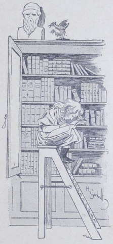

## Suzette garde-malade

Le pauvre Romulus était malade. Il avait la fièvre, toussait à fendre 
l’âme, et avait un air pitoyable en portant ses mains amaigries à sa poitrine 
dans un geste de douleur.  
Quant à Suzanne, on ne lui ôtera jamais de l’idée que Romulus est tombé 
malade de chagrin le jour où Lako a quitté la Fauconnière.  
Les adieux de Suzanne à son ami avaient été touchants.  
Lako ne pouvait plus retenir ses larmes, et ce fut avec une grande tristesse 
qu’il arriva à Paris.  
Suzanne avait bourré les poches de son ami de toutes sortes de choses, 
mélange hétéroclite que le jeune garçon devait, avec un sourire attendri, 
retrouver au lycée : plumes de métal, canifs mal affilés, pastilles de 
chocolat, macarons, bouts de crayon, ficelles multicolores, etc., etc.  
Suzanne avait fait des provisions pendant trois semaines afin de compléter le 
petit bagage de Lako.  
Après son départ, et pour imiter son application, ainsi qu’elle le lui avait 
promis, la fillette se mit courageusement au travail, et M^lle^ Crest se déclara 
satisfaite de son élève.  
Mais voyez ce que c’est que la malchance ! Il fallut que Romulus tombât 
malade juste au moment où ces bonnes résolutions allaient porter leur 
fruit : or vous comprenez que notre amie Suzette n’était pas de force à 
mener de front ses devoirs d’écolière et son rôle de mère de famille 
auprès des animaux rapportés de l’Inde.  
Ce fut donc la première tâche qu’elle sacrifia à la seconde, en dépit des 
observations de sa maîtresse et même des injonctions de tante Anne.  
Un beau matin, celle-ci trouva la petite fille, qu’on cherchait partout, 
accroupie au haut d’un marchepied dans la bibliothèque, une jambe repliée 
sous elle, l’air affairé, les cheveux en désordre, et feuilletant avec ardeur 
un gros livre qui traitait des remèdes à employer dans les affections de 
poitrine.  
Suzanne fut sévèrement grondée ! Elle était doublement coupable, car elle 
s’occupait d’autre chose que de ses leçons pendant le temps consacré au 
travail, et elle touchait sans permission aux livres de la bibliothèque.

« Alors, tante Anne, dit la petite fille désolée, il faut absolument 
appeler le médecin auprès de Romulus.  
— Le médecin ? Tu veux dire le vétérinaire.  
— Oui, c’est la même chose, puisque le médecin des animaux s’appelle ainsi, 
murmura Suzanne en remettant le gros livre où elle l’avait pris et en 
dégringolant de son échelle.  
— Mais… une visite pour cet animal,… cela coûtera cher.  
— Voyons, tante Anne, en ce cas il n’y a pas d’économie à faire. Si je 
prenais une fluxion de poitrine, moi, ne tenteriez-vous pas tout pour me 
sauver ?  
— Tu ne vas pas te comparer à Romulus, je suppose ? s’écria la vieille 
dame scandalisée.  
— Non certes, reprit l’enfant d’une voix douce et insinuante. Mais voyons, 
tante Anne, un bon mouvement,… faisons venir le vétérinaire.  
— Ma mignonne, jamais ton oncle ni ta tante ne consentiront à faire une 
dépense qu’ils regarderont comme inutile.  
— Aussi n’est-ce pas sur eux que je compte. Écoutez, tante : vous avez 
l’habitude de me faire un petit cadeau pour mon anniversaire de naissance, 
n’est-ce pas ?  
— Oui, et voici que le moment de m’exécuter approche ; est-ce pour me le 
rappeler, fillette ?  
— Oh ! fit Suzanne, vous me croyez donc si indiscrète, tante Anne ? Je 
voulais seulement vous prier de ne rien me donner cette année, et… à la 
place,… à la place…  
— Je te devine : tu voudrais que je fisse soigner ton singe.  
— Le singe de Lako, corrigea l’enfant terrible. Oui, tante Anne. Enfin, 
acceptez-vous ma combinaison ?  
— Nous allons voir d’abord comment va tourner cette maladie, et soigner 
nous-mêmes la pauvre bête ; si nous voyons que le mal empire, nous aurons 
alors recours au vétérinaire. Mais je ne veux pas que pour cette raison tu te 
détournes une minute de ton travail.  
— Non, tante, je vous promets de ne m’occuper de Romulus que pendant mes 
récréations. Merci, tante Anne ! Que vous êtes bonne, comme 
toujours ! » s’écria Suzanne en sautant au cou de la vieille dame.

La fillette tint parole, cacha son inquiétude pendant ses leçons et se mit à 
l’ouvrage avec zèle. Mais elle se dédommageait pendant ses moments de congé 
et allait tenir compagnie au malade : elle lui apportait des infusions et lui 
tenait les jambes bien chaudes.  
La pauvre bête se laissait faire avec une docilité et une résignation si 
touchantes, que les domestiques eux-mêmes finirent par en avoir pitié et par 
l’admettre à la cuisine dans un coin bien chaud, blotti dans une corbeille 
soigneusement ouatée par tante Anne.  
Disons tout de suite, afin de rassurer nos jeunes lecteurs qui doivent trembler 
pour les jours de Romulus, que le singe se rétablit petit à petit et sans 
l’aide du vétérinaire. Aussi, au commencement de l’hiver, Suzanne, radieuse, 
put-elle annoncer à Lako le rétablissement de l’animal.

« Je te l’avoue maintenant que c’est passé et qu’il n’y a plus de danger, 
écrivait-elle à son petit ami, j’ai été bien inquiète. Romulus a beaucoup 
maigri et pâli, mais il reprend chaque jour des forces et se remet à manger 
autre chose que du lait. Nous l’avons soigné comme un prince, je te l’assure. 
Kiss souffre de douleurs assez vives ; tante Harmanay a un rhume de 
cerveau ; Marine est toujours la même, c’est-à-dire pas très gentille. 
Quant aux oiseaux, ils sont un peu tristes.  
Tante Drake nous a donné de ses nouvelles comme à toi, du reste ; nous 
sommes contents de savoir qu’elle va bien, malgré tous ses soucis.  
Tante Anne me charge de te dire que ton dernier bulletin fera grand 
plaisir à ta maman quand elle le recevra. Sais-tu que c’est très beau pour un 
étranger d’avoir de si belles places ? C’est Marcel qui doit être vexé en 
constatant que tu es un meilleur élève que lui !  
Et il paraît aussi que tu fais beaucoup de progrès en musique avec ton 
nouveau professeur ; surtout n’oublie pas d’apporter ton violon aux 
prochaines vacances.  
Ta petite amie Suzanne et tante Anne t’embrassent très fort. »

C’était un jour de fête pour le pauvre Lako que celui où il recevait une 
lettre de la Fauconnière ou de Bombay.  
Il n’eût pas été positivement malheureux au lycée, parce qu’il aimait 
l’étude et que ses professeurs avaient de la sympathie pour lui ; mais on 
n’oublie pas que son cousin Marcel se trouvait dans la même classe que lui, et 
qu’il s’était promis de lui en faire voir de vertes.  
Poussés par le jeune Harmanay, plusieurs élèves s’étaient ligués contre le 
nouveau, l’_Indien_, comme ils disaient, ce petit prodige, ce travailleur qui 
leur enlevait les bonnes places, et ils le tourmentaient avec une méchanceté 
acharnée.  
On ne l’appelait que _Pain d’épice_ ; on lui cachait ses livres et ses 
cahiers, on lui faisait de stupides _niches_ au moment où le professeur 
l’interrogeait ; bref, le pauvre Lako se demandait avec épouvante s’il 
pourrait résister à cette vie-là. Dans ses lettres à la Fauconnière comme 
à celles qu’il écrivait à sa belle-mère, il ne se plaignait jamais ; 
outre qu’il n’était pas dans son caractère d’accuser les autres, il ne 
voulait inquiéter ni peiner tante Anne, Suzanne et Mrs Drake.  
À la fin, soit lassitude, soit estime pour ce jeune garçon fier, froid et 
résolu, les moins mauvais de ses condisciples cessèrent de s’acharner après 
lui ; mais Marcel et ses amis redoublèrent leurs attaques.  
L’hiver s’avançait ; Lako souffrait du froid, mais moins encore que de ces 
persécutions continuelles et silencieuses. Sa santé s’altéra, ses traits 
pâlirent, son caractère devint plus sombre ; il se montra moins studieux, 
sauf pour la musique, à laquelle il s’adonnait avec passion.  
Ses maîtres se demandèrent avec inquiétude si cet excellent élève allait 
leur échapper faute de pouvoir supporter les rudes hivers parisiens.  
On lui fit passer quelques jours à l’infirmerie, on lui fit boire du quinquina 
et d’autres fortifiants, mais le jeune garçon ne reprenait pas le dessus, 
n’avait ni appétit, ni entrain, ni gaîté.  
Comme le méchant Marcel et ses condisciples se cachaient pour le tourmenter, 
les maîtres ne se doutaient pas de la vérité, et le petit étranger continua 
à souffrir secrètement.
