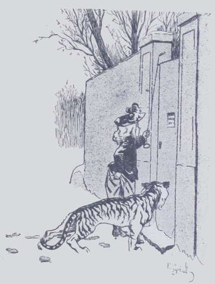
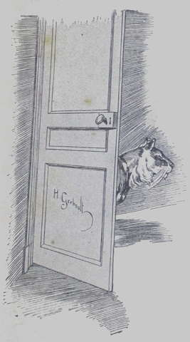
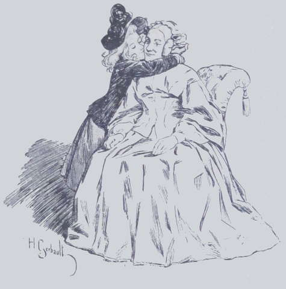

# L’enlèvement d’une tigresse

Il était environ une heure de l’après-midi ; la campagne était toute 
blanche de neige, et complètement déserte. Au loin se dressait le toit pointu 
de _Bon-Repos_, un modeste chalet habité par une vieille demoiselle très 
bonne et percluse de rhumatismes. Elle se nommait M^lle^ Irma, et tante Anne, qui 
l’aimait beaucoup, regrettait d’être aussi souvent privée de sa société ; 
mais elle n’avait pas le libre usage des voitures de la famille Harmanay, et 
l’on promenait souvent les chevaux de la Fauconnière à l’aventure, plutôt 
que d’offrir une course utile ou agréable à la pauvre tante Anne.  
Cependant, sur la neige vierge encore de pas humains ou de traces de roues, se 
détachent deux points noirs, l’un plus gros que l’autre.  
À mesure qu’ils s’approchent de _Bon-Repos_, on peut distinguer la silhouette 
d’une petite fille d’une dizaine d’années, puis celle d’un animal de la taille 
d’un gros chien. Nos lecteurs ont deviné qu’il s’agit de Suzanne Frézelle et 
de son amie Sweet-heart.  
Les deux promeneuses marchent vite, comme des personnes pressées.  
Sur le visage futé de la petite fille on aurait pu lire une hâte fébrile.  
Lorsqu’elle fut arrivée à _Bon-Repos_, Suzanne sonna timidement et dit à la 
servante qui vint ouvrir :

« Annoncez-moi à votre maîtresse, et laissez entrer Sweet-heart dans le 
hall ; elle a trop froid dehors. Soyez tranquille, elle ne vous fera pas de 
mal. »

La bonne obéit et alla dire à M^lle^ Irma :

« Mam’zelle, c’est la petite mam’zelle de la Fauconnière.  
— Mademoiselle Marine ? demanda l’excellente fille sans empressement.  
— Ah ! Dieu non, par bonheur ! C’est l’autre, la gentille, la petite 
mam’zelle Suzanne.  
— Vraiment ! la chère mignonne ! Faites-la vite entrer, Jenny ; je 
serai bien aise de la voir. »

Jenny obéit, et Suzanne Frézelle se précipita dans le boudoir, où la bonne 
demoiselle tricotait des vêtements pour les pauvres devant un bon feu de bois. 
 

« Comment vont vos rhumatismes, mademoiselle ? demanda Suzanne qui était 
très bien élevée.  
— Pas bien, mon enfant, pas très bien. Ah ! quand on avance en âge !… 
Et ta tante Anne ?… Souffrante aussi ?… Ah ! pauvres de nous ! 
Es-tu heureuse d’être jeune et ingambe !… Mais, assez parlé de ma vieille 
personne. Qu’est-ce qui me vaut l’honneur de ta visite ? »

Suzanne se troubla un peu.

« Mademoiselle , commença-t-elle, vous êtes très bonne, n’est-ce-pas ?  
— J’essaie de l’être, au moins, répondit la vieille fille en souriant ;
mais je crois bien que dans le pays on surfait ma réputation.  
— Non, non, je sais que vous êtes très bonne ; tante Anne l’a dit, et 
tout ce qu’elle dit est la vérité.  
— Je l’espère bien, fit M^lle^ Irma en souriant. Mais où veux-tu en 
venir ? »

Suzanne prit son courage à deux mains :

« Mademoiselle, reprit-elle, me permettez-vous de venir faire chez vous une 
sottise que je ne peux pas faire à la Fauconnière ?  
— Explique-toi mieux, répliqua la maîtresse de _Bon-Repos_, qui tenta de 
prendre un air sévère.  
— Voici : il s’agit d’un enlèvement. »

M^lle^ Irma bondit sur son fauteuil.

« Qu’est-ce que tu me racontes là, mon enfant ? demanda-t-elle effrayée.  
— Attendez, vous allez comprendre. Vous connaissez Lako ?  
— Oui, un, charmant petit garçon ; mais il est au lycée.  
— Oui, et c’est bien ennuyeux pour lui et pour moi. Mais connaissez-vous 
aussi Sweet-heart ?  
— Qu’est-ce que cela ?  
— Une tigresse apprivoisée qu’il a ramenée de Bombay.  
— En effet, je me rappelle l’avoir entrevue à ma dernière visite à la 
Fauconnière. Oui, une jolie bête, un beau pelage !…  
— N’est-ce pas ? fit Suzanne, rayonnante. Eh, bien, mademoiselle, cette 
bête, qui est intelligente, bien élevée et affectueuse, Lako l’aime, tante 
Anne l’aime, je l’aime…  
— Vraiment ?  
— Mais mon oncle et ma tante la détestent, et Marine lui veut du mal, sans 
compter Marcel qui est méchant pour tous les animaux.  
— C’est afin de me raconter cela que tu es venue à _Bon-Repos_, par ce temps 
de neige ?  
— Vous allez voir, mademoiselle, et il faut que je me dépêche, car à la 
Fauconnière on ne doit pas savoir ce que je suis devenue.  
— Cependant tu n’es pas ici sans permission, je suppose ? Qui t’a 
accompagnée ?  
— Sweet-heart ! » répondit l’enfant d’une voix douce, un peu craintive.

Puis, se redressant à la vue du geste de reproche de son interlocutrice :

« Mais Sweet-heart est un aussi bon chaperon que… François, par exemple, 
qui fume sa pipe tout le long du chemin et parle à tous les charretiers qu’il 
rencontre ! »

À cet instant, un grattement se fit entendre à la porte.

« Entrez ! » fit M^lle^ Irma, croyant que Jenny annonçait un autre 
visiteur.  
La porte, sans doute mal fermée, s’ouvrit doucement, et Sweet-heart parut, se 
tortillant, faisant des grâces comme une jeune chatte de salon. Ayant entendu 
son nom prononcé derrière la porte par la voix de sa petite amie Suzanne, 
elle avait cru qu’on l’appelait et elle accourait à son tour pour saluer la 
maîtresse de la maison.

« Assise, Sweet-heart ! » commanda Suzanne.  
L’animal obéit et fixa tranquillement ses yeux jaune d’or sur la vieille 
demoiselle.  
Celle-ci s’amusait beaucoup.

« Alors, continua l’enfant sans sourciller, comme à la Fauconnière ils 
cherchent à faire le plus de peine possible à ce pauvre Lako, ils ont 
condamné à mort la malheureuse Sweet-heart.  
— Condamnée à mort ?… Elle les a donc mordus ? »

Suzanne eut un geste indignée :

« Sweet-heart ?… Elle n’a jamais donné un coup de dent, ni un coup de 
patte, ni un coup de queue même. Mais ma cousine prétend que cette pauvre 
bête l’effraie ; que lorsqu’elle la rencontre au jardin, cela lui cause des 
terreurs qui lui donnent des cauchemars pendant la nuit. Alors ma tante 
Harmanay a décrété qu’elle ne voulait pas d’émotions pour sa fille, et 
qu’on se déferait de Sweet-heart, profitant pour cela de l’absence de Lako et 
de tante Drake.  
— Et toi, mignonne, qu’as-tu décrété ? » demanda M^lle^ Irma qui 
retenait un fou rire. Car, comme toutes les natures simples, bonnes et douces, 
elle était très gaie.

« Moi, je me suis promis de sauver la vie à mon amie.  
— Et tu me l’amènes ?  
— Je l’ai enlevée à sa niche, répondit triomphalement Suzanne, et je suis 
venue chez vous avec elle en me disant : « Mademoiselle Irma est si 
charitable qu’elle ne refusera pas de prendre Sweet-heart en pension chez elle 
jusqu’au retour de tante Drake… »

En prononçant ces mots, la petite fille regardait avec angoisse son 
interlocutrice, car elle n’était pas du tout sûre de son consentement.

« Et… si je refusais ? » dit la vieille fille, très grave.  
Suzanne éclata en sanglots.  
« Je la remmènerais à la Fauconnière, dit-elle entre deux sanglots, mais 
elle serait tuée dès ce soir, et Lako et moi aurions un gros chagrin. »

En voyant pleurer sa petite amie, Sweet-heart vint poser sur son épaule sa 
grosse patte de velours et fit entendre une sorte de ronron douloureux.  
Touchée de ce désespoir, M^lle^ Irma reprit :

« Elle s’ennuiera chez moi.  
— Pas plus qu’à la Fauconnière où je ne peux pas souvent lui tenir 
compagnie ; et puis, elle aura bien chaud ici », ajouta l’enfant en 
promenant autour d’elle un regard satisfait.

M^lle^ Irma bondit.

« Tu ne supposes pas, j’espère, qu’elle habitera mon salon ni ma 
chambre ?  
— Non, mais vous avez une bonne cour au midi où on lui mettra la grande 
niche de votre terre-neuve Salammbo qui est mort il y a deux ans.  
— Tu penses à tout, fit M^lle^ Irma en souriant. Et pour la 
nourriture ? »

Fièrement Suzanne tira de sa poche un petit porte-monnaie très déchiré 
d’où elle extirpa une grosse pièce, deux petites et plusieurs sous.

« J’y ai songé, dit-elle, et comme je ne veux pas que mon amie vous 
occasionne des dépenses, car je ne sais pas si vous êtes riche, j’ai apporté 
tout ce que je possède. Oh ! il y a bien de quoi aller loin : sept francs 
et huit sous ; j’amassais ça depuis longtemps pour nous payer un voyage à 
Paris, à tante Anne et à moi, et pour courir embrasser Lako ; mais il vaut 
mieux sacrifier cette fortune à Sweet-heart. N’est-ce pas, mademoiselle, que 
vous voulez bien garder la tigresse ? L’été reviendra vite et tante Drake 
aussi, alors on vous en débarrassera et vous ne pouvez pas vous figurer la 
reconnaissance que nous vous aurons tous ! » s’écria la fillette en 
sautant au cou de la bonne demoiselle, qui refusa catégoriquement ses sept 
francs et huit sous, mais voulut bien garder l’animal.

Comment résister à cette jolie et tendre Suzanne ? M^lle^ Irma adorait les 
enfants et, en particulier, la petite Frézelle.

« Allons, dit-elle, c’est convenu, mais que Sweet-heart se conduise bien : 
autrement, gare ! Et maintenant rentre vite, petite ; Jenny va 
t’accompagner, et surtout ne recommence pas pareille équipée ! Sauve-toi, 
mais ne m’étouffe pas. »

Dans sa joie reconnaissante, Suzanne embrassait M^lle^ Irma avec tant de 
véhémence, que le bonnet de la vieille demoiselle en resta posé tout de 
travers.  
Avant de suivre Jenny qui chaussait de fortes galoches, la fillette entoura de 
ses bras le cou de la tigresse et lui tint ce discours :

« Sweet-heart, vous allez rester avec M^lle^ Irma, la meilleure personne du 
monde avec tante Anne et Lako… Vous ne tenterez pas de me suivre ; ici vous 
aurez chaud et vous serez bien traitée ; tâchez donc d’être sage et de 
vous montrer reconnaissante pour les bienfaits dont vous êtes l’objet. »  
« Et ne soyez pas gloutonne ! » ajouta la fillette dans l’oreille de la 
bête.

Sweet-heart donna un coup de langue sur les mains rouges de Suzanne et alla 
sagement s’asseoir dans un coin du hall, en attendant qu’on préparât sa niche 
sous un hangar bien abrité du froid.  
Hélas ! faire cette dernière recommandation, c’était prêcher dans le 
désert : Sweet-heart avait à elle seule l’appétit de six collégiens de 
dix-huit ans ; mais elle ne devait point pâtir.  
D’abord M^lle^ Irma pouvait supporter facilement ce surcroît de dépense, et 
puis sa cuisinière, Denise, prit la tigresse en affection et la gâta outre 
mesure.  
Quatre jours plus tard, le boucher lui disait en lui remettant son panier 
alourdi de plusieurs kilos de viande :

« Eh ! eh ! il paraît que votre maîtresse a de nombreux hôtes ?  
Maintenant, nous ne sommes pourtant pas dans la saison où l’on vient à la 
campagne ; mais il y a des gens que le froid n’épouvante pas.  
— Vous vous trompez, m’sieu Clampin, répondit Denise ; ma maîtresse est 
toute seule à _Bon-Repos_.  
— Ah bah ! alors vous avez donc tous pris des appétits féroces ?… fit 
le boucher en riant. Mes compliments ! On ne s’en plaint pas, vous savez !  
— Eh ! mon Dieu, oui, répliqua Denise avec une certaine fierté ; on se 
porte bien chez nous, et puis vous n’ignorez pas que le froid aiguise la 
faim ; or il gèle à pierre fendre ! »
