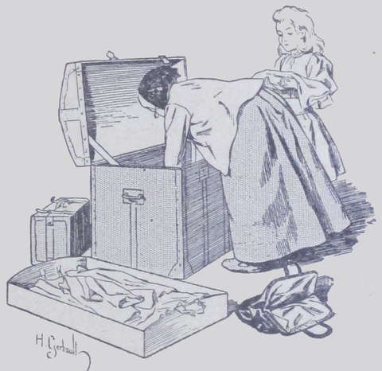
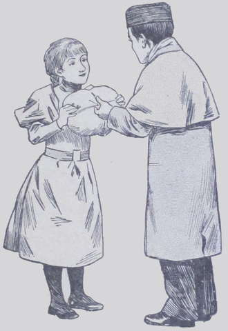

## Changement sur toute la ligne

Le soir du jour mémorable où Suzanne conduisit la tigresse à _Bon-Repos_, la 
Fauconnière retentit d’appels caressants tels que :

« Sweet-heart ! Viens, ma biche !… Viens, ma belle ! voilà du 
gigot… Viens donc !… Sweet-heart ! Sweetheart !… »

Blottie dans les jupes de tante Anne, Suzanne laissait ses cousins chercher et 
appeler, riant sous cape avec tante Anne, à laquelle elle avait tout raconté.  
On finit par croire que l’animal, flairant le danger, s’était enfui dans la 
campagne.

« Certainement elle n’y fera pas de vieux os, ricana Marine. Avec ce froid, 
elle qui n’aime pas la neige !… »

Et personne ne parla plus de Sweet-heart, sauf tante Anne et Suzanne.  
Deux ou trois fois pendant le mois suivant, M^lle^ Irma envoya Jenny prendre la 
fillette à la Fauconnière, pour lui faire passer une journée à 
_Bon-Repos_ ; alors ce furent des fêtes pour Suzanne.  
Mais bientôt on pensa beaucoup moins à l’excellente bête, grâce aux 
événements qui suivirent.  
Un matin, arriva une lettre de Bombay, accompagnée d’une autre qui venait du 
lycée où Lako était pensionnaire. Les deux missives disaient que 
l’adolescent souffrait trop de l’hiver à Paris et qu’il devait prendre des 
précautions.  
Le proviseur conseillait à Mrs Drake de retirer son beau-fils du lycée, où 
il avait contracté une petite toux peu inquiétante encore, mais qui, de 
l’avis du médecin, pouvait le devenir.  
Mrs Drake n’hésitait pas : joignant à sa lettre un chèque de cinq mille 
francs au nom de tante Anne, elle suppliait celle-ci de partir le plus tôt 
possible avec Lako pour Hyères, et d’y passer le reste de l’hiver.

« De plus, ajoutait-elle en post-scriptum, emmenez la petite Suzanne avec 
vous ; ses tuteurs ne peuvent me refuser cela ; elle distraira et égaiera 
mon pauvre Lako, qui, sans elle, s’ennuierait beaucoup. »

La veuve appuyait là-dessus avec insistance, sachant que les Harmanay ne 
donneraient pas facilement leur autorisation en ce qui concernait leur 
pupille ; mais on n’ignore pas que nul n’osait résister à tante Drake. 
Enfin M. Harmanay, las de discuter, s’était écrié :

« Laissons donc partir cette enfant !… D’abord, c’est un débarras pour 
nous, et puis, il ne faut pas mécontenter Mabel… On ne sait pas ce qui peut 
arriver… »

Suzanne et tante Anne firent alors leurs paquets en toute hâte et attendirent 
impatiemment la venue de Lako, qu’un ami des Harmanay ramenait de Paris à 
Reims. Marine bouda. Jalouse du bonheur de sa cousine, elle voyait partir avec 
regrets sa compagne d’étude et de jeux ; ses parents ne la consolèrent 
qu’en lui promettant un prochain voyage à Paris et beaucoup de jouets. Enfin, 
Lako débarqua à la Fauconnière ; son oncle était allé le chercher à 
Reims. Mais ce n’était plus le bel enfant bien portant arrivé de Bombay moins 
d’une année auparavant : il était pâle comme un fiévreux, extrêmement 
amaigri, et une vilaine petite toux sèche sifflait à chaque instant dans sa 
gorge. Ses yeux noirs, déjà si grands, semblaient encore agrandis et se 
cernaient de bleu.
À sa vue, Suzanne détourna la tête, pour qu’il n’aperçût point deux 
grosses larmes qui voilaient ses prunelles.
Marine elle-même, en voyant le jeune garçon dans cet état, se sentit le 
cœur serré.

« Le froid t’a fait beaucoup de mal, mon pauvre Lako ! » lui dit-elle 
d’une voix plus douce que de coutume.

Lako la regarda de ses longs yeux pensifs et tristes, et se pencha, pour 
qu’elle seule l’entendit :  
« Il n’y a pas que le froid qui m’ait fait du mal, répondit-il ; il y a 
aussi là-bas des camarades bien méchants. »

Marine comprit et baissa la tête. Elle pleurait ; son cœur, qui, jusqu’à 
ce jour, avait toujours été dur et froid, s’amollit et connut la pitié.  
Elle devint bonne et attentionnée pour le malade, lui céda sa chambre pour le 
peu de temps qu’il devait passer à la Fauconnière, et lui apporta elle-même 
ses infusions et ses repas.  
Tante Anne était très étonnée de ce changement. Quant à Suzanne, elle se 
disait en elle-même avec un indicible serrement de cœur :

« Il est donc bien malade, puisqu’elle a des remords ? »

Dès que Lako se trouva en état de supporter un second voyage par le mauvais 
temps, le petit trio se mit en route.  
Par économie, on n’emmenait pas de domestique ; Suzanne commençait à se 
montrer assez bonne petite femme de ménage ; à Hyères on louerait une 
modeste villa, et l’on prendrait une servante à tout faire.  

Au moment du départ, Marine se glissa auprès du jeune Drake :

« Lako, lui dit-elle, pardonne-moi toutes mes méchancetés d’autrefois ; 
je les regrette beaucoup, va ! Je ne t’appellerai plus _Pain d’épice_ et je 
serai gentille pour toi quand tu reviendras à la Fauconnière. Tiens, prends 
ce petit souvenir que j’ai acheté avec mes économies. Quant à tes oiseaux, 
à Romulus et à Kiss, je te promets de très bien les soigner en ton absence.  
— Je te remercie, ma petite Marine ! » répondit Lako en l’embrassant.

En route il défit le paquet que la fillette avait déposé sur ses genoux : 
il contenait d’abord une jolie garniture de paletot en belle fourrure, puis une 
grosse boîte de bonbons fins.  
Lorsque, quelques semaines plus tard, Marine alla voir son frère au lycée, 
elle refusa de l’embrasser.

« Oh ! oh ! qu’as-tu donc, ma petite sœur ? demanda le jeune garçon.  
— Il y a que tu es un méchant, et que tu as contribué à mettre le pauvre 
Lako dans l’état où il est. »

Marcel baissa la tête et n’osa nier.  
Depuis il ne se passa point de semaine sans que Marine envoyât à Hyères, sur 
son argent de poche, soit un jouet nouveau, soit un livre intéressant. De leur 
côté, Lako et Suzanne expédiaient de belles fleurs à leur cousine et 
échangeaient de longues lettres avec elle.
