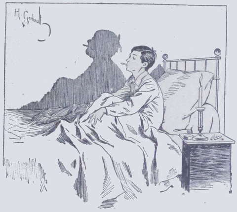
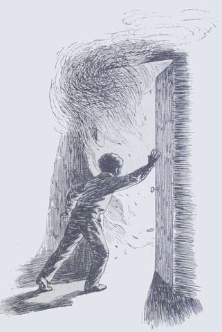

## L'incendie

Du soleil, de l'air pur, des fleurs et la présence de tante Anne et de 
Suzanne : il y avait de quoi ressusciter quelqu'un de plus malade que Lako.  
Au bout d'un mois, l'enfant ne toussait plus et avait recouvré non des 
couleurs, car il en avait rarement, mais sa belle pâleur chaude habituelle, 
son gai sourire, sa voix sonore et moelleuse tout ensemble, et un appétit 
raisonnable.  
Suzanne exultait ; elle suppliait tante Anne de ne pas faire part de cette 
amélioration à la Fauconnière, de peur qu'on ne les y rappelât.  
Une personne qui était bien contente aussi et qui remerciait le bon Dieu, 
c'était tante Drake, qui recevait chaque semaine un bulletin détaillé de la 
santé de son cher Lako.  
Néanmoins elle décida qu'il ne retournerait pas au lycée en avril en 
revenant d'Hyères, mais qu'il passerait le printemps et l'été à la 
Fauconnière, afin de se fortifier complètement.  
Puis, comme Mrs Drake devait rentrer à l'automne en France, elle se réservait 
d'organiser alors sa vie et celle de l'enfant.  
Elle remerciait tante Anne et Suzanne de leurs soins pour son beau-fils, et 
promettait de leur prouver sa reconnaissance.  
Elle ne disait rien de ses affaires, mais le ton de sa lettre faisait présager 
une solution meilleure qu'on n'osait l'espérer.
Le petit trio ami fut bien heureux en recevant ces nouvelles. Quelle joie de 
penser que Lako partagerait la vie de la Fauconnière pendant tout l'été, 
comme l'an passé !  
L'hiver s'écoula donc joyeusement pour la tante et les deux enfants.  
Dès que l'air était assez chaud, la tante Anne les emmenait à la promenade 
ou au bord de la mer ; dans ce pays charmeur, Lako retrouvait un peu des 
parfums et des brises, tièdes de son pays ; il se chauffait au soleil, se 
baignait dans le sable doré et passait de longs moments à contempler, à 
l'heure du couchant, la mer couleur d'azur et d'or fondu.  
Tout le monde les aimait autour d'eux ; d'abord, tante Anne se montrait 
toujours affable ; puis, Lako intéressait avec sa jolie figure de créole. 
Enfin chacun prenait plaisir à caresser la gentille fillette aux boucles 
blondes.
Tante Anne, ne voulant pas que les enfants perdissent leur temps, leur avait 
découvert un professeur très expérimenté que sa santé forçait à passer 
l'hiver dans le Midi et qui consentait à donner chaque jour, pour une modeste 
rétribution, trois heures de leçon à deux élèves dociles et intelligents 
comme l'étaient Lako et Suzanne.

De plus, le premier, qui n'était jamais plus heureux que lorsqu'il faisait de 
la musique, étudiait le violon sous la direction d'un bon maître.  
Aussi le jeune Drake et sa petite amie firent-ils de grands progrès, tout en 
fortifiant leur santé.  
Tante Anne se trouvait bien aussi de ce changement de régime et d'air.  
Hélas ! pourquoi cette vie délicieuse ne pouvait-elle pas durer 
toujours ?  
Peu à peu, Hyères se dépeupla ; les étrangers regagnèrent leurs 
pénates, les hôtels se fermèrent, la ville devint triste et la chaleur 
accablante.  
Il fallut dire adieu à la mer bleue et calme, aux roches roses noyées dans 
une vapeur fraîche, aux soirées étoilées et aux promenades charmantes.  
M. et Mme Harmanay, qui devaient assister un jour à une noce à Reims, avaient 
prévenu qu'ils ne rentreraient pas coucher à la Fauconnière. Marcel profita 
de l'absence de ses parents pour s'amuser à fumer.  
Mais, manquant de prudence, après avoir allumé une cigarette dans sa chambre, 
il jeta son allumette à terre sans se donner la peine de souffler dessus.  
Ce fut son dernier exploit de la journée ; aussitôt après il s'endormit.  
Ce soir-là, Sweet-heart, qui était revenue de _Bon-Repos_, trouva moyen de se 
glisser à la suite d'un serviteur qui rentra tard, et de coucher dans le grand 
vestibule, où elle se sentait plus près de son cher petit maître.  
Vers minuit, Lako entendit gratter à sa porte. Il se leva, inquiet, et alla 
ouvrir. Une masse sombre entra dans la chambre, et sa main rencontrant une 
tête ronde et des oreilles courtes, le jeune homme se dit :  
« C'est Sweet-heart ! Comment est-elle là ? Il faut que j'en aie le 
cœur net ! »  
Il frotta une allumette ; et, tandis qu'il allumait sa bougie, il sentit une 
singulière odeur, mais il n'y prêta point tout d'abord une bien grande 
attention.  
Cependant la tigresse, au lieu de sauter joyeusement autour de son maître 
comme elle avait l'habitude de le faire chaque fois qu'elle le voyait, donnait 
des signes d'inquiétude, tournait vers lui des yeux suppliants et anxieux, et 
se dirigeait vers la porte pour revenir aussitôt auprès de lui comme pour 
l'inviter à la suivre.  
« Cette bête a du flair, se dit encore Lako. Elle sent un danger, mais 
lequel ? Si j'allais voir ?... Il y a peut-être des voleurs dans la 
maison. Je n'ai pas d'armes ; que faire ? Et mon oncle et ma tante qui sont 
absents !... Si je réveillais tante Anne ? Non, cela l'effraierait. Les 
domestiques, alors ? Oui, c'est cela, car pour Marcel, il n'y faut pas 
songer : il est trop poltron. »  
Lako se vêtit à la hâte et se mit en devoir de monter à l'étage 
supérieur ; mais Sweet-heart lui barra le passage et, mordillant sa blouse, 
le tira d'un autre côté.  
Cette fois, l'odeur de fumée qui avait déjà surpris l'adolescent, le saisit 
fortement à la gorge ; de plus, en tournant à droite il aperçut des nuages 
épais et suffocants qui enveloppaient le corridor.  
« Il y a le feu par ici, se dit-il. Dieu ! c'est chez Marcel, et le 
malheureux n'appelle pas !... Serait-il déjà asphyxié ?... »  
Et sans hésiter cette : fois, il cria :  
« Au feu, au secours ! par ici, chez Marcel ! Au feu ! au feu ! De 
l'eau ! »  
Puis, sans attendre que la maison s'éveillât, il s'élança dans la fumée, 
rencontra en tâtonnant la clé de la porte de Marcel, qui céda sous sa 
pression.  
Des flammes s'élevaient déjà dans un angle de la chambre.  
« Marcel ! Marcel ! pour Dieu, lève-toi ! » cria douloureusement 
Lako.  
Marcel ne répondit pas.  
Au seuil de la porte, Sweet-heart reculait en grognant d'une manière 
terrible ; elle eût bien suivi son maître, mais le jeune Harmanay était 
la, et on sait que la tigresse le détestait ; de plus, les fauves ont peur 
du feu.  
Cependant Lako avait fini par arriver auprès du lit de son cousin ; sa main 
ne rencontra qu'un visage glacé.  
Les flammes l'éclairaient assez maintenant pour qu'il vit autour de lui, 
malgré la fumée de plus en plus suffocante.  
« Mon Dieu, aidez-moi ! donnez-moi la force ! » murmura-t-il.
Et, rassemblant toute sa vigueur, il tira du lit le corps inerte. Il était 
temps : les flammes, qui léchaient le plafond, avaient atteint les rideaux.  
Hélas ! le corps de Marcel était trop lourd pour le pauvre Lako. La sueur 
baignait son front et il se sentait défaillir à son tour. Cependant il put 
entraîner son cousin en le faisant glisser sur le tapis. Il parvint à gagner 
la porte et le corridor, en tirant par son vêtement de nuit le pauvre Marcel 
privé de  connaissance.

Pendant que se passait cette scène rapide, les domestiques s'éveillaient 
lentement à l'étage supérieur, se demandant l'un à l'autre :
« N'as-tu pas entendu appeler ?  
- Oui, on dirait qu'il y a du bruit au premier.  
- Diable ! et Monsieur et Madame qui ne sont pas là !  
- On sent une odeur étrange : si c'était le feu ? »  
Le feu !... à ce mot terrifiant ils se jetèrent tous à bas du lit.  
Le plus prompt d'entre eux arriva juste à temps pour recevoir dans ses bras 
Lako et Marcel à demi suffoqués.  
Tante Anne et ses nièces, réveillées à leur tour, firent emporter les deux 
jeunes garçons dans l'appartement du rez-de-chaussée, où elles leur 
donnèrent des soins.  
Lako revint promptement à lui, mais Marcel, demeuré plus longtemps dans une 
atmosphère asphyxiante, fut plus lent à reprendre ses sens.  
Par bonheur, aucune catastrophe n'était à redouter.  
Les domestiques purent se rendre maîtres du feu en arrachant tout ce qui lui 
servait d'aliment. La Fauconnière était d'ailleurs pourvue d'une petite 
pompe, qui éteignit bientôt les flammes.  
L'allumette jetée négligemment par Marcel avait atteint un large panier de 
paille où l'on accumulait toutes sortes de débris ; pendant le sommeil du 
jeune homme tout cela avait brûlé, puis le feu avait gagné le meuble voisin, 
et enfin un véritable commencement d'incendie s'était produit.  
Lorsque, le lendemain, M. et Mme Harmanay apprirent le danger qu'avaient couru 
leurs enfants et toute la maison, ils devinrent pâles de saisissement.  
Ils remercièrent Lako assez chaleureusement et daignèrent flatter de la main 
la tigresse Sweet-heart lorsque Marine la leur amena.  
Quant à Marcel, il reçut une sévère punition pour son imprudence. Le pauvre 
garçon ne fit pas de maladie à la suite de cette terrible alerte, mais il en 
demeura longtemps comme hébété. Par exemple il ne fit plus de méchancetés 
à Lako.  
La vie reprit son cours paisible à la Fauconnière ; les enfants 
continuèrent à jouer et à travailler alternativement, mais sans plus se 
quereller désormais.  
Sweet-heart jouissait de la béatitude la plus complète ; tous les 
domestiques la caressaient depuis l'affaire du feu.
