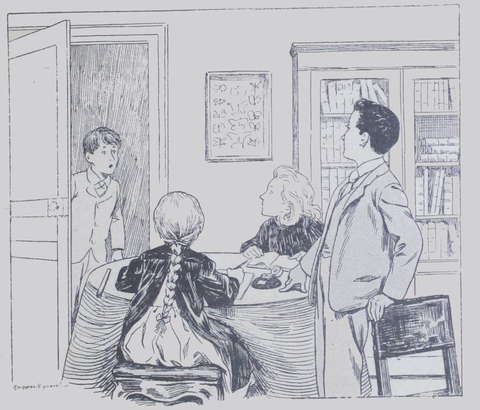
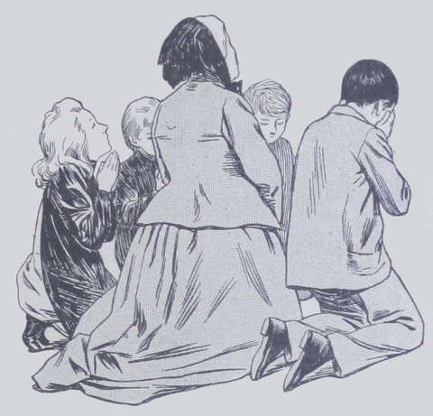

## Hélas ! Hélas !

Marcel Harmanay était dans sa chambre, réparée et remise à neuf, où il 
avait juré de ne plus allumer une cigarette, lorsqu’il entendit cette plainte 
proférée dans l’appartement voisin :

« Ah ! quel malheur ! quel malheur ! »

C’était la voix de sa mère.  
Celle de son père répéta aussitôt après :

« Oui, c’est un grand malheur ! Une affreuse catastrophe !  
— Que va devenir ce pauvre Lako ?  
— Nous ne pouvons nous en charger, cependant, maintenant qu’il n’a plus ni 
parents, ni fortune.  
— Certes non, nous avons deux enfants, et nous ne sommes pas trop riches. 
Ensuite, ce Lako n’est pas notre parent. Cette malheureuse Mabel n’était que 
sa belle-mère. »

Ici, nouveaux. soupirs.

« Ils ont dit _n’était_, pensa Marcel qui tendait l’oreille, car la 
discrétion n’était pas sa vertu principale. C’est donc que tante Drake est 
morte ? »

Il écouta derechef.

« Pauvre Mabel ! reprit M. Harmanay ; après tout, elle était la femme 
de mon demi-frère, et je crois qu’elle nous affectionnait.  
— Et puis, mourir noyée, c’est une fin affreuse ! »

Marcel n’en entendit pas davantage : courant, éperdu, à travers la maison, 
il entra comme un fou dans la salle d’étude, où Lako faisait réciter une 
leçon à Suzanne, et il leur cria :

« Hélas ! quel malheur !  
— Qu’y a-t-il ? Quel malheur ? Que veux-tu dire ? Voyons, parle vite…  
— Tante Drake !…  
— Eh bien ? Tante Drake ? Est-elle malade ?  
— Hélas ! Elle est morte !  
— Que dis-tu ? demanda Lako qui se dressa blanc comme un linge.  
— Il ne sait pas ce qu’il raconte, s’empressa de dire Marine qui assistait à 
cette scène et qui avait plus de tact que son frère.  
— C’est vrai, tante Drake est morte ; elle s’est noyée ; papa et maman 
sont en bas qui pleurent. »

Sans en entendre davantage, Lako marcha comme un automate jusqu’à la chambre 
de son oncle.

« Est-ce vrai ? » dit-il en entrant.  
M. et M^me^ Harmanay le regardèrent.

« Tu sais donc tout, mon pauvre enfant ? lui répondirent-ils. Qui donc 
t’a instruit de cette affreuse catastrophe ? »

Mais Lako n’ouvrit plus la bouche et tomba comme une masse.

« Méchant sot ! s’écria Suzanne en s’adressant à Marcel.  
— Imbécile ! ajouta Marine, car les trois cousins avaient suivi le jeune 
Drake.  
— Marcel s’est trompé, n’est-ce pas, tante ? disait en pleurant la petite 
Suzanne, tandis qu’on donnait des soins à Lako couché sur un divan. Il ne 
peut pas être tout à fait orphelin ! C’est trop dur ! C’est trop 
triste ! Il serait tout seul au monde.  
— Hélas ! mes enfants, c’est la vérité même ; seulement Marcel a eu 
tort de nous devancer et de lui annoncer si brusquement cette nouvelle. Enfin, 
le plus pénible est fait, et maintenant que le pauvre garçon sait tout, il ne 
nous reste qu’à le consoler le mieux possible. Tenez, le voilà qui rouvre les 
yeux ; il paraît très souffrant, nous allons le coucher. Marine, va 
chercher ta tante Anne ; il faut bien lui apprendre la catastrophe, à elle 
aussi. La pauvre femme va être extrêmement affligée ! »

Marine obéit et ramena peu après tante Anne toute tremblante ; la bonne 
dame avait lu sur le visage terrifié de la fillette l’annonce d’un malheur.

« Qu’est-il arrivé ? s’écria-t-elle. Pourquoi Lako paraît-il si malade, 
et pourquoi Suzanne pleure-t-elle ? »

Et, songeant aussitôt à la seule personne chère pour laquelle elle eût à 
craindre, outre celles qui se trouvaient là :

« Mabel ? » ajouta-t-elle en pâlissant.  
Sans parler, M^me^ Harmanay lui tendit un journal dans lequel se trouvait un 
article souligné de rouge qui frappa tout de suite les yeux de la vieille 
dame.

« Mon Dieu ! Mon Dieu ! » murmura celle-ci en se laissant tomber dans 
un fauteuil.  
L’article annonçait en termes concis que le navire le _Gange_, parti de Bombay 
le 15 septembre, avait sombré dans la mer Rouge par un temps calme, à la 
suite de l’explosion de la chaudière. Suivaient les noms des passagers, dont 
un seul avait échappé à la mort, et qui avait perdu la raison après 
l’effroyable accident.

À la fin de la sinistre nomenclature, on lisait : Mabel Drake, veuve, 
cinquante-deux ans. Le bateau a péri corps et biens.  
En apprenant la terrible nouvelle de la mort de M^me^ Drake, tante Anne demeura 
un instant frappée de stupeur, les mains croisées sur ses genoux, dans une 
attitude douloureuse.

« Et pourtant, murmura-t-elle enfin, si le journal se trompait ?  
— Comment voulez-vous qu’il se trompe ? répliqua M^me^ Harmanay en réprimant 
un mouvement d’épaule. Comment aurait-on mis le nom de Mabel sur la liste des 
victimes si elle ne se trouvait pas sur le bateau ?  
— Hélas ! » soupira la veuve, se rendant à l’évidence.

Puis, au bout d’une minute de silence pendant laquelle chacun réfléchissait 
tristement :

« Pourquoi Mabel ne nous avait-elle pas annoncé qu’elle quittait Bombay et 
revenait en France ?  
— Elle était un peu originale, ma belle-sœur, vous le savez bien, tante Anne, 
répliqua M. Harmanay.
— Quand elle nous est arrivée, il y a dix-huit mois environ, nous a-t-elle 
prévenus autrement que par un télégramme lancé de Marseille, quelques 
heures avant de faire son entrée à la Fauconnière ? ajouta M^me^ Harmanay.  
— C’est vrai, soupira tante Aune qui se raccrochait à toutes les espérances, 
même les plus frêles ; et pourtant, je ne sais pourquoi, je doute 
encore !  
— Vous avez tort, dit M. Harmanay, car ce pauvre Lako va se bercer d’illusions 
superflues. D’ailleurs, pour ne conserver aucune arrière-pensée à cet 
égard, je vais écrire tout de suite au consulat d’Angleterre et au Ministère 
de la marine. »

Tante Anne se leva et, prenant dans ses bras son pauvre Lako qui ne pouvait 
pleurer :

« Venez, mes chéris, dit-elle, nous allons prier ensemble pour la chère 
tante Drake. »

Elle rentra chez elle avec les deux orphelins et ils prièrent avec ferveur en 
pleurant ; quelques minutes plus tard, Marine et Marcel vinrent se joindre à 
eux, et leur présence apporta un peu de baume au cœur meurtri de Lako.  
Le désespoir du pauvre petit fut effrayant ; sans l’affection profonde de 
tante Anne et de Susy, il serait tombé malade de chagrin. D’un caractère 
réservé, peu expansif, il souffrait d’autant plus que les choses extérieures 
ne pouvaient guère le distraire.
Tante Anne eut soin qu’il s’adonnât de plus en plus a la musique, à l’étude 
de son violon, pour détourner sa pensée de l’idée fixe qui occupait sans 
cesse son esprit.  
Les renseignements que M. Harmanay obtint du consulat et du Ministère de la 
marine ne donnèrent pas d’éclaircissements : le nom de Mabel Drake était 
bien, en effet, sur la liste des passagers du _Gange_, et, comme tous ces 
passagers avaient péri, sauf un homme, il restait donc malheureusement certain 
que l’Anglaise était morte.  
Le beau-frère de la défunte écrivit également à Bombay pour savoir où en 
étaient ses affaires.  
Soit mauvaise foi de la part de ceux auxquels il s’adressa, soit que la pauvre 
Mrs Drake eût réussi moins que jamais dans sa dernière tentative, il lui fut 
répondu que l’Anglaise mourait absolument ruinée et que son beau-fils n’avait 
droit à aucune des sommes réclamées par elle.  
C’était donc la pauvreté, la misère même pour le jeune Drake, qui supporta 
vaillamment ce coup, dont les Harmanay se montrèrent certainement plus 
atterrés que lui.

« J’ai une petite rente, m’a-t-on dit ; n’aie pas peur, lui murmura 
Suzanne à l’oreille ; je partagerai tout ce que je possède avec toi et avec 
tante Anne.  
— Non, répondit Lako d’un ton ferme tout en l’embrassant ; je gagnerai ma 
vie et je veux me mettre à travailler dès maintenant. »

Pauvre enfant ! il n’avait pas quinze ans !  
Personne, toutefois, n’avait parlé de Blanc-Blanc, le bon nègre, qui avait 
accompagné tante Drake à Bombay.

« Il sera mort là-bas, soupira Lako, et maman n’aura pas voulu me 
l’annoncer par lettre. Pauvre Blanc-Blanc ! il nous aimait tant et il se 
serait jeté au feu pour nous. Encore un brave et fidèle cœur qui nous 
manque. »

Et tout le monde pensa comme lui.
