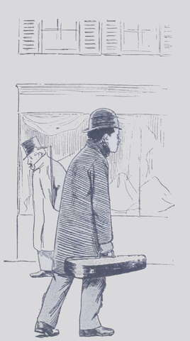
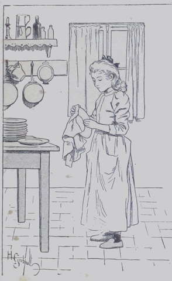

## Pauvres, mais joyeux

Ce n’était pas la misère, mais c’était certainement la gêne qui pesait sur 
la vie de ces trois êtres ; par bonheur, ils se chérissaient tendrement, et 
l’affection qui les unissait leur faisait supporter bien des privations.  
Tante Anne, Lako et Suzanne avaient quitté la Fauconnière pour s’établir à 
Paris, afin que l’éducation des deux enfants pût être menée à bonne fin.  
Les Harmanay ne les avaient retenus que mollement, pour la forme, bien aises au 
fond d’être débarrassés de la triple charge de la veille dame, de Suzanne et 
de l’adolescent.  
De quoi subsislait donc le petit trio ? Car l’existence est coûteuse à 
Paris, et la modeste rente de la fillette ne parvenait pas à nourrir tout le 
monde.  
Une ancienne amie de M^me^ Anne, morte peu après les événements que nous 
venons de raconter, avait eu la bonne inspiration de lui léguer une somme de 
six mille francs.  
Au lieu de réserver pour ses vieux jours cette somme arrivée si à propos, 
tante Anne la consacra entièrement à l’éducation de Lako.

« Cela nous mènera bien jusqu’à ce que le pauvre enfant puisse se tirer 
d’affaire lui-même, pensait-elle ; alors, je le connais, il rendra cent pour 
un à sa bonne vieille amie, et si je ne vois pas ce moment, eh bien, je m’en 
irai de ce monde avec la satisfaction de l’avoir sorti de peine. »

Elle loua, au cinquième étage d’une maison de la rue Bleue, un petit 
appartement composé de deux chambres à coucher, d’une salle à manger et 
d’une petite cuisine. Cela suffisait ; elle occupait une des deux pièces 
avec Suzanne, et Lako habitait la seconde.
Dès sept heures du matin, la vieille femme et la fillette, aidées d’une 
ménagère, mettaient le logis en ordre et préparaient le déjeuner. Pendant 
ce temps Lako étudiait déjà.  
À neuf heures, le jeune homme allait prendre sa leçon de violon chez son cher 
maître qu’il avait retrouvé, et il ne rentrait que pour le repas de midi. 
Ensuite, selon le temps, Suzanne et son ami, accompagnés de M^me^ Anne, 
faisaient une salutaire promenade, ou allaient s’asseoir au square Montholon 
pour respirer un peu d’air pur.  
Lorsqu’on rentrait, c’était pour travailler de nouveau, et avec courage. Lako 
étudiait encore la musique ; puisqu’il voulait en faire sa carrière, il 
fallait y consacrer le plus de temps possible. Suzanne faisait ses devoirs, 
puis elle aidait tante Anne à tricoter de petits ouvrages de fantaisie, dont 
la vente, à un magasin de gros, apportait quelques douceurs dans le ménage.

Ensuite on devait songer au repas du soir, qu’on prenait frugal, mais avec 
appétit et gaîté.  
Malgré le souvenir attristant de tante Drake qui planait encore sur le petit 
cercle, les deux enfants avaient l’humeur joyeuse de leur âge ; et puis ils 
s’aimaient tant !  
Dans la maison on adorait tante Anne, Suzanne et Lako que l’on croyait frère 
et sœur. Et ne l’étaient-ils pas, sinon par les liens du sang, du moins par 
l’affection qui les unissait ?  
Les locataires de l’immeuble, dont ils n’occupaient qu’une minime partie, 
éprouvaient une admiration profonde pour M^me^ Anne, cette noble femme qui 
supportait si courageusement le malheur et dont la voix était si douce et 
l’air si résigné.  
Lako était la passion des petits enfants de la maison, qui cessaient de crier 
dès que retentissaient les accords de son violon.  
Il y avait également, au-dessous de l’appartement de nos amis, deux pauvres 
infirmes que sa musique berçait, et qui ne sentaient plus autant l’acuité de 
leurs douleurs dès que l’adolescent posait l’archet sur la corde.

« Pauvres enfants, murmurait parfois tante Anne en les contemplant, vous 
n’étiez pas nés pour vivre aussi pauvrement, toi surtout, mon Lako, qui n’as 
connu jusqu’à présent que le luxe et le bien-être.  
— Ma chère petite tante, répliquait alors Suzanne toujours prompte à la 
riposte, nous sommes très contents de notre sort ; donc ne nous plaignez 
pas, ce serait du temps perdu. Si nous avons un regret, c’est bien plutôt pour 
vous dont l’âge et la santé exigeraient plus de soins et de confort.  
— Oh ! moi… fit tante Anne avec un geste d’insouciance.  
— Susy a raison, ma tante, ajoutait Lako gravement ; il n’est pas si 
regrettable pour nous de n’être pas riches. Mon professeur me répète souvent 
qu’il est aussi funeste pour un homme de ne manquer de rien que de manquer de 
tout. Or nous n’en sommes heureusement pas encore là !  
— Hélas ! il ne faudrait qu’une maladie ! pensa douloureusement la vieille 
dame.  
— Et, continua Lako, je pourrai bientôt commencer à gagner un peu 
d’argent ; mon maître me l’a dit. Alors, pauvre tante Anne ! vous 
laisserez de côté ces méchants ouvrages qui vous fatiguent les yeux ; vous 
aurez une bonne pour vous servir ; Susy n’abîmera plus ses doigts mignons à 
balayer et à faire de grossiers ouvrages, et vous serez mieux nourrie, ce qui 
est chose essentielle à votre âge. »

Tante Anne sourit à cette évocation de bonheur futur, mais en elle-même elle 
pensait :

« Tout cela est très joli, mais il se passera encore du temps avant que ce 
gentil Lako gagne de l’argent. Il n’a pas quinze ans, et la vie à Paris coûte 
cher. Enfin, Dieu nous viendra en aide. Tant que nous avons tous la santé, 
c’est déjà beaucoup. »

Comme pour affirmer mieux ses heureuses prédictions, le jeune Drake prit son 
violon et attaqua un chant de gloire et d’allégresse.  
Suzanne embrassa la vieille dame.

« Comment voulez-vous qu’avec un talent pareil il ne devienne pas très 
riche un jour ? » dit-elle.  
Et elle se mit bravement à essuyer la vaisselle.
