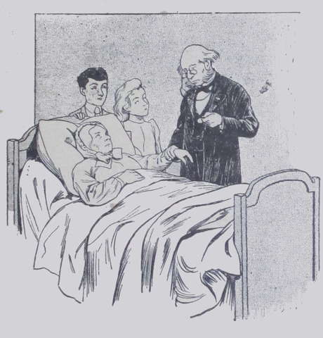
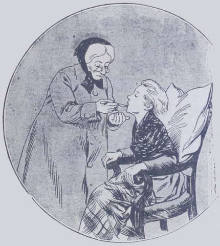
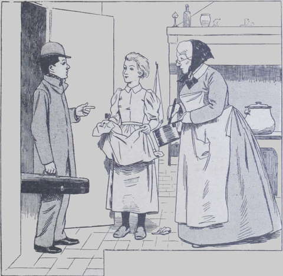

## Encore du noir

L’hiver s’était écoulé sans encombre ; le printemps arriva.  
Tante Anne se félicitait intérieurement d’avoir résisté aux rhumes, 
bronchites, douleurs et sciatiques, et remerciait Dieu de la bonne santé de 
ses neveux, qui s’étaient ri du froid et de la neige.  
Hélas ! elle réjouissait trop tôt : un matin d’avril, elle ne put quitter 
son lit, prise par cette ennuyeuse maladie, plus mauvaise que la grippe, qu’on 
nomme l’influenza.  
À l’âge de tante Anne, c’était grave, et cela pouvait dégénérer en 
congestion pulmonaire.
Le jeune Drake et sa petite compagne n’hésitèrent pas une minute à appeler 
à son chevet un médecin connu et habile.  
Ce médecin, avec l’aide de Dieu, sauva la malade, mais il ne put la remettre 
sur pied avant un mois et demi, et pendant ce temps l’argent diminua rapidement 
en passant entre les mains des fournisseurs, pharmaciens et marchands de 
charbon, car on devait entretenir un feu continuel dans la chambre de la 
malade.  
Ensuite, ce fut le docteur qu’il fallut payer ; et puis, obligée de servir 
jour et nuit sa tante, la petite Suzanne ne pouvait plus travailler, et le 
magasin auquel elle fournissait jadis de jolis ouvrages au crochet, se fermait 
à une ouvrière inexacte.  
Enfin, tante Anne revint à la santé ; mais quel soupir elle poussa quand 
elle fit les comptes du mois passé, et comme elle gronda les enfants d’avoir 
tant dépensé pour elle et de n’avoir reculé devant aucun sacrifice pour la 
guérir plus promptement !  
Et voilà que, peu de temps après, tandis que l’été naissant dissipait un 
peu les inquiétudes et les soucis, survint un nouveau malheur.  
Un matin, en se levant, Suzanne fut prise de faiblesse ; on la recoucha ; 
un peu plus tard elle voulut se relever, mais le vertige, le mal de tête et 
les maux de cœur continuèrent et devinrent même intolérables ; la fièvre 
survint ; et malgré les supplications de la fillette qui prétendait être 
sur pied le lendemain, tante Anne fit appeler un médecin.  
Celui-ci reconnut une fièvre muqueuse et conseilla d’éloigner Lako.
Suzanne pleura : le jeune garçon résista ; il voulait partager avec tante 
Anne les soins à donner à la « petite sœur ». Mais tante Anne fut 
inexorable, et le pauvre Lako quitta le logis.

Une voisine complaisante le recueillit ; mais, quoiqu’il eût tous les jours 
des nouvelles de la malade, l’adolescent n’avait plus le cœur au jeu ni à 
l’étude et rongeait son frein avec impatience en attendant l’heure de la 
réunion.  
On sait combien ces fièvres muqueuses, qui n’offrent pas une grande gravité 
en général, amènent une longue convalescence et demandent de soins assidus.  
Quand Suzanne quitta son lit, le médecin ordonna des bains fortifiants, des 
vins généreux, des jus de viande et des promenades en voiture pour ramener 
les forces perdues.  
Ah ! Dieu sait que la pauvre tante Anne, dont les économies s’en allaient 
pièce à pièce, ne regarda à rien pour suivre ces indications.  
Et comme la convalescente se tourmentait beaucoup de ces dépenses, car la 
pauvre petite avait appris de bonne heure à connaître le prix de l’argent, il 
fallait user de toutes sortes de subterfuges pour lui faire accepter les 
boissons toniques et le régime ordonnés par le docteur.  
Enfin Lako put revenir au logis ; quelle fête ce fut pour tous ! Pourtant 
le jeune homme eut les larmes aux yeux, à la vue du petit visage de Suzanne, 
pâli et amaigri, et de ses jolis cheveux coupés aujourd’hui et jadis si 
longs.  
Tante Anne calculait dans sa tête, tout en faisant marcher ses aiguilles, ce 
qui lui restait d’argent pour les trois années pendant lesquelles Lako ne 
gagnerait encore rien et dépenserait forcément davantage.  
Hélas ! il y avait une énorme brèche au petit trésor, et tante Anne se 
demandait quel travail elle pourrait bien entreprendre, afin qu’on pût joindre 
au moins les deux bouts.  
Heureusement on entrait dans le mois de juin, et le feu n’était plus de saison 
depuis plusieurs semaines ; oui, mais il fallait manger, fortifier cette 
petite Suzanne, lui acheter des vêtements neufs, car elle avait tellement 
grandi pendant sa fièvre muqueuse, que ses robes de l’été passé ne 
pouvaient plus servir ; il fallait également payer les leçons de Lako, et 
habiller le jeune homme convenablement.  
Mon Dieu, mon Dieu ! comment se tirer de là ?… Tante Anne ne pouvait se 
décider à faire part de sa situation aux Harmanay ; les enfants étaient en 
correspondance assez suivie avec leurs cousins, qu’on avait mis tout à fait en 
pension cette fois ; mais, depuis deux mois, M. et M^me^ Harmanay voyageaient 
en Italie, et la bonne vieille dame ne savait trop comment serait accueillie 
une demande d’argent.

Cependant on touchait à l’époque du Grand Prix ; Paris était très 
animé ; c’était fête partout ; les théâtres donnaient leurs derniers 
opéras, leurs derniers drames ; les hôtels et les riches demeures, leur 
derniers bals ; des concerts s’organisaient de tous les côtés ; aussi le 
professeur de Lako, qui donnait partout des auditions, était-il excédé.  
Un après-midi, tandis que les enfants et tante Anne s’habillaient pour leur 
promenade quotidienne, on sonna.

« Nous n’attendons pourtant pas de visite aujourd’hui, dit gaîment Suzanne. 
À moins que Marcel et Marine ne se soient échappés de leur cage…  
— Folle ! » fit Lako en riant.

Ce fut le jeune homme qui alla ouvrir ; il repartit seul, tenant à la main 
un billet, que, en garçon bien élevé, il présenta à tante Anne, quoiqu’il 
fût adressé à M. Drake.  
Tante Anne le parcourut rapidement des yeux et le lui rendit. C’était une 
invitation de son professeur à se rendre chez lui avant quatre heures.

« Tu vas y aller tout de suite, dit la vieille dame ; rien ne t’en 
empêche, ton temps est libre. Il ne faut pas faire attendre ton professeur.  
— C’est sans doute pour remplacer ma leçon de demain, qu’il ne pourra pas me 
donner à l’heure convenue, murmura l’adolescent. Je vais toujours emporter mon 
violon. »

Il partit donc de son côté, et Suzanne ne trouva pas sa promenade aussi 
agréable, malgré le beau soleil, la brise tiède et les passants joyeux : 
Lako lui manquait.
Cependant, ce dernier s’en allait en chantonnant par le chemin le plus court.  
Il arriva chez son maître au moment ou celui-ci préparait sur son divan une 
toilette de gala.  
L’artiste se retourna vivement et s’avança vers le jeune homme.

« Ah ! c’est vous, Drake, dit-il ; mon cher enfant, avez-vous du courage ?  
— Je ne sais, monsieur ; c’est selon, répondit Lako étonné de cet exorde.  
— Êtes-vous timide ?  
— Je ne l’ai pas été beaucoup jusqu’à présent.  
— Vous sentez-vous de force à jouer du violon devant une assemblée de mille 
personnes au moins ?  
— Oh ! maître ! » fit l’adolescent terrifié.  
L’artiste n’y allait pas par quatre chemins ; il était brusque, mais bon.

« Voyons, mon cher enfant, reprit-il, je n’ignore pas que vous n’êtes pas 
riche et que votre bonne tante a été gênée par deux récentes maladies. Ces 
choses-là se devinent, surtout chez nous autres, gens de l’art qui ne sommes 
pas toujours riches. Aussi ai-je pensé à vous, de préférence à mes autres 
élèves, plus âgés que vous. »

Lako se demandait toujours où son professeur voulait en venir.

« Voulez-vous gagner cinq cents francs en une soirée, enfin ? » demanda l’artiste.  
— Moi, monsieur ? Si je veux ?… Cinq cents ?… cinq cents 
francs ?… et en une soirée ?… »

Lako suffoquait.

« Mais ce n’est pas possible, monsieur, ajouta-t-il ; j’en suis incapable, 
je ne suis qu’un enfant… »

Le maître frappa légèrement du pied avec une impatience affectée :

« Il ne faut pas me contredire ; je sais ce que j’avance, parbleu !… 
Voici ce dont il s’agit : un artiste célèbre, X…, dont je vous ai parlé 
souvent, devait jouer ce soir à la Salle Philharmonique… Oh ! des soli, 
heureusement, rien que cela, sauf un morceau avec accompagnement d’orchestre, 
que l’on rayera du programme. Cet artiste, qui est mon ami, reste auprès du 
lit de sa femme gravement malade ; vous comprenez que sa séance musicale est 
impossible ?  
— Oh oui ! monsieur.  
— Il m’a prié de lui trouver promptement un remplaçant.  
— Et vous avez pensé… ?  
— Oui, mon enfant, j’ai pensé à vous. Il n’y a que cinq heures jusqu’au 
concert ; cela suffit pour vous y préparer, mais non pour me donner le 
loisir de chercher un troisième violoniste. Voyons, mettez-vous là, et 
jouez-moi votre _Fantasia appassionata_ ; c’est généralement votre 
triomphe. »

Lako obéit et joua.  
C’était son triomphe, en effet, que la _Fantasia appassionata_, et il rendit 
merveilleusement la pensée du maître.  
L’artiste l’écoutait, hochant la tête pour approuver aux passages les mieux 
exécutés, et coupant d’observations ceux qu’il trouvait plus faibles.  
Quand ce fut fini :

« C’est assez bien, dit-il, vous avez du brio et du sentiment ; cela 
remplacera le fini qui vous manque. À présent, vite l’_Air hongrois_. »

L’enfant reprit son violon ; l’_Air hongrois_ était difficile, mais Lako le 
travaillait depuis longtemps et le savait bien.

« Ensuite, comme il est à supposer qu’on vous applaudira ferme et qu’il 
faut toujours se montrer généreux envers un public flatteur, vous reprendrez 
votre violon après les salutations d’usage et attaquerez un troisième 
morceau. Voyons, quelque chose de facile et de gai…
Cherchez donc, Lako, je ne me rappelle pas ce que vous pourriez faire entendre 
encore.  
— La _Chanson indienne_ ? suggéra timidement Lako.  
— Ah non ! ma foi ! un air à porter en terre ! et puis, trop monotone ; on
sifflerait, pour le coup. Cherchez encore.  
— La Mélodie de Bizet ?  
— Hum ! J’ai grand’peur que vous ne l’ayez oubliée ; voyons pourtant. »

La Mélodie de Bizet vint sous l’archet si jolie et si expressive, que 
l’artiste murmura à part lui :

« J’ai bien fait de jeter mon dévolu sur ce gamin. Outre qu’il est 
admirablement doué, l’appât des cinq cents francs lui fait faire des 
miracles. Il aura un succès fou, ce garçon-là, ce soir. Et puis ce nom 
étranger de Lako Drake sonne bien et plaira au public. Allons ! ça ira, ça 
ira, et il m’en reviendra de l’honneur, car Lako est mon élève depuis près 
d’un an. Décidément j’ai eu du flair ! »

Seulement, afin que son disciple ne contractât point d’orgueil, l’artiste 
reprit tout haut :

« Mon cher enfant, tout cela suffira pour… boucher le trou, comme on 
dit ; mais n’allez pas vous figurer, parce qu’on vous applaudira, que vous 
êtes un Paganini ou un Sarasate ; sachez qu’on applaudit et bisse tous les 
artistes de nos jours ; et puis, vous avez la chance d’être jeune, très 
jeune même, de porter un nom étranger, tout cela disposera en votre 
faveur ; le public est ainsi. Tâchez, par exemple, de ne pas faire 
d’accrocs, et jouez sans penser que vous êtes devant mille ou quinze cents 
personnes.  
— Oui, monsieur, mais… ce sera bien difficile dans le premier moment.  
— Bah ! bah ! il faut avoir de l’audace pour réussir, mon enfant, et de 
l’énergie. Les timides n’arrivent à rien. À présent, laissez votre violon, 
car il ne faut pas trop vous fatiguer jusqu’à ce soir. Vous dînerez avec moi, 
légèrement, pour apaiser le plus fort de l’appétit. Après la séance je me 
charge de vous faire souper, et nous boirons à votre, premier succès !  
— Mais,… objecta l’enfant, ma tante…  
— Oui, oui, nous savons cela : la tante et la petite sœur seraient 
inquiètes. Voici ce que vous allez faire. J’ai un ami à voir au bout de la 
rue Lafayette ; je vais prendre un fiacre ; vous y monterez avec moi et je 
vous déposerai chez vous ; vous demanderez à madame votre tante 
l’autorisation de jouer ce soir à la Salle Philharmonique (ce qu’elle ne vous 
refusera pas), et de dîner avec moi.  
Vous endosserez votre plus beau costume ; il est inutile de passer chez 
le coiffeur, puisque vos cheveux sont frisés par la nature. À six heures et 
demie soyez ici pour avaler un blanc de volaille et boire une tasse de bon 
café. Puis nous partons ; je vous conduis à la Salle Philharmonique en vous 
recommandant à Maître X… Envoyé par moi, vous serez accueilli les yeux 
fermés ; de mon côté, je gagne la salle Érard où je n’entre en scène 
qu’à dix heures, donc après vous, et je reviens vous chercher un peu avant 
minuit. À propos, je vais vous donner deux billets d’entrée pour votre tante 
et votre jolie sœur. »

Lako mit dans sa poche les deux billets de faveur que son professeur lui 
tendait, le remercia chaleureusement, et, quelques minutes plus tard, monta en 
voiture avec lui.  
Tante Anne et la petite fille, de retour de leur promenade, préparaient les 
légumes du dîner lorsque Lako se présenta à elles.
Son visage exprimait une telle émotion, ses yeux étaient si brillants, que 
Suzette courut à lui, laissant tomber de son petit tablier la salade fraîche 
qui s’y amoncelait.

« Tu as certainement une bonne nouvelle à nous annoncer ; voyons, parle 
vite ! s’écria-t-elle.  
— Il faut auparavant que je demande la permission à tante Anne », répliqua 
le garçonnet.  
Alors il raconta l’entretien qu’il avait eu avec son maître, et exposa ses 
projets pour le soir. Il ne tut qu’une chose : le prix qu’il espérait 
recevoir pour son audition musicale.  
D’abord, l’artiste avait peut-être jeté trop en l’air ce chiffre de cinq 
cents francs qui paraissait énorme à Lako : l’enfant ne voulait pas donner 
une fausse joie à sa tante ni à sa petite amie.

« Tu vas peut-être bien rapporter cinquante francs ! s’écria Suzanne 
avec emphase. Gagner cinquante francs, en quelques heures, mon Dieu ! quand 
il faut faire tant d’ouvrages au crochet ou tant de bandes de tapisserie pour 
en avoir seulement vingt !  
— J’ai connu des artistes, fit tante Anne rêveuse, qui recevaient trois mille 
francs pour jouer deux ou trois morceaux dans une soirée. Mais leur 
réputation était faite, leur talent indiscutable ; on ne donnera sans doute 
rien à un novice comme Lako qui paraît pour la première fois en public ; 
il ne faut pas te faire illusion, mon pauvre chéri… »

Lako ne répondit pas et retint un sourire malicieux ; il espérait bien au 
moins cent francs, lui.  
Mais, quand il exhiba les deux billets d’invitation au concert pour M^me^ Anne et 
sa nièce, la joie de Suzanne ne connut plus de bornes.  
La fillette sauta, rit, chanta et pleura.  
M^me^ Anne manifesta d’une manière plus calme sa satisfaction.  
Il fallut bien vite songer aux toilettes. Celle de Lako surtout fut préparée 
avec un soin extrême ; puis on s’occupa de celle de Suzanne, et enfin tante 
Anne tira du fond d’un tiroir, pour elle-même, une robe de soie, démodée 
mais encore belle.  
On dut acheter une cravate et des gants, mais que n’eût-on pas fait en 
l’honneur du triomphe certain du cher Lako ?

« C’est encore une dépense, pensait l’excellente veuve, et nous sommes 
déjà si pauvres ! bah ! je prendrai les gants et la cravate au 
Bon-Marché, et mes chéris ont si gentille mine par eux-mêmes qu’ils 
plairont, j’en suis sûre… Je me priverai de quelque chose ces jours-ci pour 
rattraper ces folies. »
