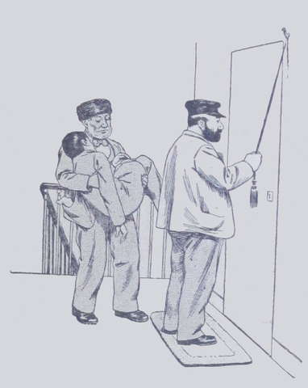

## Pour une chute

On était triste, ce jour-là, dans le petit logis de la rue Bleue. Tante Anne 
tricotait en silence, et, par extraordinaire, Suzette ne chantait pas.  
Il faisait beau pourtant, au dehors ; un froid sec invitait à la promenade, 
le soleil brillait dans le ciel bleu pâle, et l'on entendait un joyeux 
mouvement dans la rue.  
Et cependant, ni tante Anne, ni la petite Frézelle n'avaient envie de 
sortir ; elles restaient blotties près du feu, pensives, sans se parler.  
Soudain, des pas précipités se firent entendre sur le palier.  
On frappa : tante Anne se leva et Suzette devint toute blanche.  
C'étaient des hommes qui portaient un fardeau.

« Mon Dieu ! Lako ! cria Suzanne, qui se retint à une chaise pour ne 
pas tomber.  
— Seigneur, que lui est-il arrivé ? gémit la pauvre tante Anne, prête, 
elle aussi, à défaillir.  
— Ne vous effrayez pas, ma bonne dame, dit un des hommes, ni vous, ma jolie 
petite demoiselle. L'enfant vit et n'est qu'évanoui. Il n'a même d'autre mal 
qu'un bras cassé, par exemple. Seulement, il a eu peur et s'est évanoui, ni 
plus ni moins qu'une fillette.  
— Comment cela est-il arrivé ? demanda Mme Anne en s'empressant autour du 
malade, dont elle frotta les tempes avec de l'eau de Cologne.  
— Ah ! ces garçonnets sont bien imprudents, Voyez-vous ! Il traversait la 
rue, le nez en l'air, rêvant à je ne sais quoi... Un cocher lui crie : 
« Hop ! » Il se recule vite en arrière. « Hop ! » fait un 
autre cocher qui venait en sens opposé. Paf ! mon jeune homme n'a pas le 
temps de se garer, ni le cheval celui de s'arrêter ; le pauvre enfant s'en 
va rouler à dix pas, contre un refuge, où des gens l'ont relevé. Il n'a 
jeté qu'un cri : « Mon bras gauche ! Ah ! mon Dieu ! mon 
violon !... » Puis il a perdu connaissance. Une personne qui le connaît 
nous a donné son adresse, et le voilà. Ne vous désolez pas, ma bonne 
dame ; ça ne sera pas grand chose. »

Quand l'homme eut fini sa tirade, tante Anne lui glissa dans la main une pièce 
de cinq francs en lui disant :

« Maintenant, allez vite, vous ou votre camarade, me chercher le docteur 
Mastre ; c'est un bon chirurgien. Il faut que le bras de mon pauvre enfant 
soit bien remis sans retard et bien soigné. »

Les deux hommes remercièrent Mme Anne, la saluèrent et coururent chez le 
médecin en question.  
Ils eurent la chance de le trouver chez lui et lui indiquèrent la maison de 
Mme Anne, où M. Mastre n'hésita pas à se rendre en toute hâte.

Lako avait repris ses sens, mais il ne pouvait ni bouger ni parler, et ses yeux 
exprimaient une cruelle souffrance.  
Le chirurgien remit immédiatement le bras cassé en deux endroits. Puis il 
disposa l'appareil dans lequel le pauvre petit blessé devait rester plusieurs 
semaines.
Suzanne avait commencé par se boucher les oreilles pour ne pas entendre crier 
son cher Lako ; mais elle pensa qu'il aimerait sans doute mieux la sentir 
près de lui, courageuse et calme ; et, quoique toute pâle et toute 
tremblante, elle demeura vaillamment de l'autre côté du lit, essayant de 
sourire à son petit ami et tenant dans la sienne la main qu'il avait de libre.  
Lako ne poussa pas un cri, mais son visage n'aurait pu être plus pâle.  
Tante Anne, courageuse et résolue, elle, aidait le chirurgien et lui 
présentait les objets dont il avait besoin.

« Là, mon petit ami, voila qui est fait ! dit ce dernier lorsque tout fut 
fini. Il ne va pas se lever de quatre à cinq jours ; puis, il pourra marcher 
un peu, et ensuite sortir tant qu'il voudra ; mais il gardera l'appareil 
pendant trois semaines, et d'ici là je viendrai le visiter. S'il survenait un 
peu de fièvre, madame, vous ne vous en inquiéteriez pas ; ce serait une 
conséquence toute naturelle de l'accident. En ce cas, vous donneriez a boire 
au blessé la potion que je vais ordonner. Surtout, qu'il ne mange pas durant 
vingt-quatre heures ! Qu'il prenne seulement de la tisane.  
— Monsieur, dit alors Lako, parlant pour la première fois depuis qu'on l'avait 
rapporté au logis, au bout de ces trois semaines je pourrai jouer du violon, 
n'est-ce pas ? »

Le docteur Mastre détourna la tête et répondit en grommelant :

« Nous verrons ça, nous verrons ça ! Il y a temps pour tout. »

Puis il partit.  
Après son départ, Lako eut une fièvre si violente que tante Aune, effrayée, 
faillit renvoyer chercher le médecin. Mais, vers le soir, la fièvre se calma 
et l'enfant put s'assoupir.  
Suzanne le veilla jusqu'à onze heures, et tante Anne la remplaça pendant le 
reste de la nuit.  
La pauvre vieille dame fit de douloureuses réflexions pendant cette veillée 
silencieuse et morne. C'était un surcroît de malheur qui lui arrivait. Le 
violon de Lako était, en effet, devenu leur gagne-pain, et maintenant qui 
pouvait dire quand le jeune garçon aurait la force de reprendre son travail, 
si même il devait jamais retrouver l'élasticité de sa main gauche, la plus 
utile pour faire chanter l'instrument ?  
Hélas ! tante Anne soupira, prit son rosaire et se fia à la Providence.  
À partir de cette nuit, le blessé ne souffrit plus beaucoup physiquement ; 
le bras fut long à se remettre, néanmoins il se remit. Au bout de trois mois, 
Lako était guéri, seulement l'enfant perdit le sourire et tomba dans une 
sorte de marasme qui inquiéta tante Anne. Il était toujours doux et docile, 
mais il semblait n'avoir plus tout l'entrain de son âge.

« Cela reviendra, se dit Mme Anne ; le pauvre chéri s'ennuie ; il 
était habitué à étudier toute la journée ; son violon lui manque. »

Hélas ! Lako sentait son bras si raide, sa main si engourdie, qu'il se 
demandait s'il recouvrerait jamais l'usage de ses doigts. Cette idée le 
chagrinait, mais il n'en parlait pas, de peur de faire de la peine à sa tante 
et à Suzanne.  
Cette dernière avait été précieuse pendant la réclusion du blessé : elle 
le soignait, le gâtait, l'embrassait, l'amusait, lui faisait la lecture, lui 
racontait des histoires, s'occupait de lui à table, le servait adroitement ; 
mais quelque saillie qu'elle inventât pour l'égayer, elle ne pouvait plus 
obtenir un sourire.
