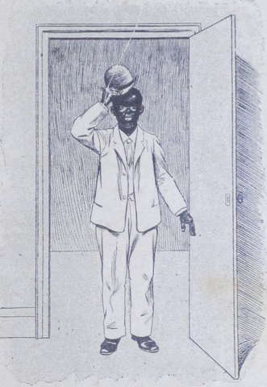
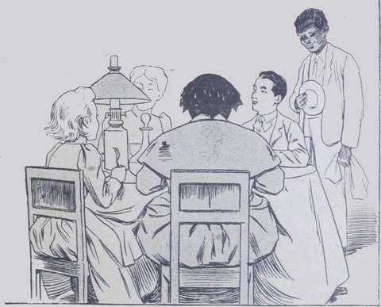

## Où l’on voit quelque chose de bien extraordinaire

Un silence mortel pesait sur le petit trio… Assise dans un coin de la 
chambre, tante Anne contemplait le foyer où s’éteignaient les derniers 
tisons… On n’osait raviver le feu : le charbon coûte cher, et l’on avait si 
peu d’argent ! Par économie aussi, on n’allumait pas la lampe. Il n’était 
que cinq heures du soir à peine, mais en janvier la nuit tombe vite.  
Suzanne et Lako étaient assis l’un près de l’autre ; ils ne parlaient pas 
et semblaient profondément tristes.  
Qu’était-il donc arrivé ?  
Il était arrivé que Lako avait essayé depuis plusieurs jours de reprendre 
son violon, mais en vain : ses doigts, crispés par une longue immobilité, 
refusaient de se mouvoir, ce qui n’avait rien de bien étonnant. Le plus 
inquiétant, c’est que le bras ne pouvait plus se plier comme autrefois, ni 
tenir l’instrument pendant plus de quelques minutes sous le menton.  
On s’était décidé à aller trouver de nouveau le docteur Mastre, quoique les 
consultations de ce célèbre médecin coûtassent fort cher.

« Ah ! ma foi ! ma borne dame, répondit le chirurgien, il est certain 
que l’enfant ne recouvrera jamais la souplesse ni l’élasticité de son bras. 
Je ne vois qu’un remède suprême : c’est de le conduire pendant deux ou trois 
années, au printemps, dans les Pyrénées ou aux eaux d’Aix, et l’été aux 
bains de mer. À ce prix, l’enfant, qui est jeune, pourra peut-être oublier 
qu’il a failli être estropié. »

Tante Anne remercia le docteur, et s’en alla tenant la main de l’adolescent 
qu’elle sentait trembler dans la sienne.  
Lorsqu’ils furent dehors, ils n’échangèrent pas une parole, et rentrèrent 
ainsi au logis, où Suzanne apprit la vérité de la bouche de sa tante.  
Voilà pourquoi nous trouvons le trio silencieux, presque lugubre, blotti dans 
l’ombre auprès du feu mourant.  
Hélas ! ils savaient tous les trois que le remède indiqué par le docteur 
Mastre était impossible… Il fallait beaucoup d’argent pour aller aux eaux et 
aux bains de mer, et on n’en avait pas !  
Lako resterait donc à demi estropié ? C’en était donc fait de son avenir 
et de sa fortune ?

« Mon Dieu, venez à notre aide ! » soupira tout à coup tante Anne.  
Comme pour répondre à cette invocation, un pas pesant se fit entendre sur le 
palier, tandis qu’un poing solide heurtait la porte.  
Tante Anne ouvrit, pendant que Suzanne allumait rapidement la lampe.  

C’était un nègre du plus beau noir.

« C’est-il ici ?. » commença-t-il.  
Mais on ne le laissa pas achever. Suzanne et Lako se jetèrent à son cou avec 
des cris de joie.

« Blanc-Blanc ! c’est Blanc-Blanc ! » s’écrièrent-ils.
On referma la porte, on le fit asseoir, on ranima le feu, et on s’assit en 
cercle autour de lui.

« Tu n’es donc pas mort, Blanc-Blanc ? dit Lako, dont le sourire apparut 
enfin. Alors comment es-tu revenu en France ? Tu es donc riche ?  
— Pas mort, mon maître, fit le nègre en riant. Comment revenu en France ? 
Mais avec maîtresse, bien sûr ! »

« Ah ! pensa tristement Lako, c’est juste : mes pauvres parents ayant 
disparu, Blanc-Blanc, qui doit gagner son pain, a trouvé d’autres 
maîtres. »

« Est-elle bonne pour toi, au moins, ta nouvelle maîtresse ? » demanda 
Suzanne.  
Le nègre ouvrit de grands yeux.

« Blanc-Blanc n’avoir jamais d’autre maîtresse que bonne dame Drake, et 
être en avant-coureur d’elle ici ; oui, en avant-coureur, elle a bien 
dit. »

Blanc-Blanc ne parlait pas le plus pur français, aussi ses interlocuteurs 
crurent-ils avoir mal compris sa phrase.

« Et comment as-tu su que nous sommes ici ? » reprit Lako.  
Le nègre devint grave.

« Voila, dit-il : bonne maîtresse à Blanc-Blanc avoir été bien malade 
pendant quatorze mois, et pas pouvoir écrire.  
— Ta maîtresse actuelle ? fit M^me^ Anne.  
— Actuelle ? répéta Blanc-Blanc, pour qui ce mot était vide de sens.  
— Oui. Chez qui es-tu maintenant ? Comment s’appellent tes maîtres ? » 
appuya Lako.

Le noir ouvrit une bouche énorme et roula des yeux étonnés.

« Mais… et mistress Drake, donc ! la maman à petit maître que 
voilà ! »

Tante Anne, Lako et Suzanne hochèrent tristement la tête : « Le pauvre 
homme est devenu fou », pensèrent-ils.

Blanc-Blanc ne comprenait rien à la réception qui lui était faite, et 
pourquoi ses anciens maîtres lui posaient des questions qui lui paraissaient 
si étranges.  
Tout à coup, sans que personne eût frappé ni sonné, la porte s’ouvrit, et 
une dame entra avec un grand bruit de jupes soyeuses.  
On ne voyait pas le haut de son corps, parce que la lampe n’éclairait qu’un 
cercle restreint sous l’abat-jour de papier ; toutefois, à son arrivée, 
tous se levèrent, comme poussés par une émotion singulière.

« Eh bien, dit une voix féminine et joyeuse, on ne m’embrasse pas ? Je 
pense pourtant que Blanc-Blanc vous a suffisamment préparés… »

Un triple cri s’éleva :

« Mabel !  
— Maman !  
— Tante Drake !  
— Non ! ce n’est pas possible !  
— Ce n’est pas elle !  
— Ça ne peut pas être elle ! » répétaient les enfants et la vieille dame.

Toutefois le doute commençait à s’effacer graduellement de leur esprit ; la 
surprise n’était pas foudroyante puisqu’ils avaient déjà reçu une secousse 
à l’entrée de Blanc-Blanc, et que les paroles de celui-ci, tout incohérentes 
qu’elles étaient, avaient commencé à les émouvoir ; néanmoins ils n’en 
croyaient pas leurs yeux ni leurs oreilles.  
L’Anglaise s’était précipitée sur son fils et le couvrait de caresses, que 
l’adolescent lui rendait passionnément.  
Puis tante Anne et Suzanne eurent leur tour. Le nègre considérait cette 
scène en montrant toutes ses dents blanches dans un large sourire.

« Enfin ! Eux avoir compris ! » murmurait-il.

On s’assit ; on essuya les yeux humides de larmes de joie ; on s’examina 
mutuellement, puis tante Drake prit la parole :

« Je vois à votre stupéfaction, mes chers amis, dit-elle, que cet étourdi 
de Blanc-Blanc n’a pas su vous préparer à mon retour, un peu brusque, il est 
vrai ; je lui avais pourtant bien répété sa leçon ! Et je vois aussi 
que vous me croyiez tous encore à Bombay.  
— À Bombay ? Mais non ! firent les deux enfants abasourdis.  
— Ma chère Mabel, dit tante Anne, nous vous croyions tout simplement au fond 
de la mer Rouge avec vos compagnons de voyage. Aussi, jugez de la désolation 
dans laquelle nous étions.  
— C’est donc pour cela que je trouvais à votre intérieur un air de détresse 
et de mélancolie… qui a bien vite disparu à mon arrivée, je dois le 
reconnaître. »

M^me^ Drake se mit à rire et poursuivit :

« C’est vrai ; les journaux ont raconté que j’étais morte !… Il faut 
que je vous raconte les choses par le menu. Au moment donc où, après avoir 
gagné mon fameux procès, j’allais m’embarquer sur le _Gange_ avec ma fortune 
reconquise, non sans peine, je vous l’assure, je m’aperçus que j’avais oublié 
à l’hôtel un portefeuille contenant des papiers importants. Vous devez savoir 
que c’est un peu ma coutume d’oublier mes affaires par-ci, par-là. Mais, cette 
fois, mon étourderie me sauva, tout en me devenant funeste d’un autre côté.  
« Je retournai à l’hôtel, ne pouvant y envoyer Blanc-Blanc ; pressée, 
craignant de manquer le départ du paquebot, qui ne m’attendrait pas, je le 
savais, je négligeai de prendre les précautions habituelles contre l’ardeur 
du soleil, et je tombai en entrant chez moi, frappée d’insolation. Je faillis 
en mourir, mais, grâce à Blanc-Blanc…  
— Comment ! grâce à Blanc-Blanc ? interrompit Suzanne.  
— Eh oui ! il m’a pour ainsi dire sauvé la vie. En me voyant si malade, le 
maître de l’hôtel jugea bon de prévenir ceux qu’il croyait être mes 
parents, qui sont, en réalité, mes ennemis, et auxquels je venais d’enlever 
légitimement l’héritage qu’ils détenaient.  
« Ah ! vous comprenez qu’ils n’avaient pas intérêt à me voir recouvrer 
la santé : je ne conteste pas leur bonne volonté et je ne soupçonne pas non 
plus leur bonne foi, mais ils mirent auprès de moi un médecin incapable, 
stupide, grotesque, en un mot une sorte de charlatan mi-anglais, mi-indien, qui 
me soigna d’une manière ridicule.  
« Au bout de quelques mois, voyant que son traitement ne réussissait pas du 
tout, et au contraire aggravait mon état, mon brave et fidèle serviteur 
Blanc-Blanc jeta par la fenêtre toutes les drogues du fameux docteur, expulsa 
la femme que celui-ci m’avait imposée pour garde, et la remplaça par une 
sœur de l’Espérance qu’il découvrit à Bombay. Puis il me traita lui-même, 
avec des plantes médicinales, à la façon de son pays, et, grâce à lui et 
à sœur Marie-Louise, qui m’ont soignée avec un dévoûment infatigable, je 
suis revenue lentement, mais sûrement, à la vie et à la santé.  
« Pendant ce temps, le _Gange_ faisait naufrage en traversant la mer 
Rouge ; ma place avait été perdue à bord, comme vous le savez, mais, par 
une négligence fatale des employés, mon nom était resté sur la liste des 
passagers, et c’est ainsi que je fus comptée au nombre des naufragés.  
— Fort bien, dit tante Anne ; je conçois alors l’erreur regrettable qui nous 
a tous plongés dans le deuil ; mais, ma chère Mabel, pourquoi, dès votre 
guérison, ne nous avez-vous pas donné signe de vie ?  
— Je l’aurais certes fait si je l’avais pu ! Mais la maladie dura très 
longtemps, comme je viens de vous l’apprendre, et la convalescence me laissa 
pendant plusieurs mois les nerfs et le système cérébral dans une telle 
faiblesse que le moindre effort intellectuel m’était interdit. Je n’avais que 
vaguement conscience de l’inquiétude en laquelle vous deviez être, et quant 
à charger mon brave mais ignorant serviteur de vous écrire et de vous 
rassurer, il n’y fallait pas songer. Je suis très excusable, vous le voyez. Je 
n’ai recouvré que très tard la faculté d’agir et de penser ; vous devinez 
alors que pendant ce temps mes affaires allaient tant bien que mal…  
— Alors vous revenez pauvre ? » demanda Lako, que frappèrent ces derniers 
mots.

L’Anglaise ne répondant pas, Suzanne ajouta-avec commisération :

« Pauvre tante Drake ! vous n’avez plus rien ! Mais nous avons au moins 
du pain, nous, et nous serons heureux de le partager avec vous et votre fidèle 
Blanc-Blanc.  
— Nous gagnerons de l’argent pour vous et pour tante Anne, et dès que je serai 
plus âgé, dit Lako en fermant les poings, j’irai à Bombay châtier ceux qui 
vous ont fait du mal et qui vous ont dépouillée injustement ! »

Une lueur d’émotion passa sur la figure un peu flétrie de l’Anglaise ; puis 
un sourire malicieux, aussitôt réprimé, erra sur ses lèvres.

« Mais de quoi vivez-vous ? demanda-t-elle, puisque je n’envoyais plus la 
pension de Lako. »

Les deux enfants et la vieille dame se firent un signe imperceptible, que 
l’Anglaise saisit au passage.

« Oh ! fit tante Anne, qui du regard mesurait l’appartement pour savoir 
où l’on dresserait un quatrième lit, il y a la petite rente de Suzette ; et 
puis, à Paris, quand on sait s’y prendre, on vit à si bon marché !  
— Et Lako a gagné beaucoup d’argent ! » s’écria la fillette, 
qu’interrompit aussitôt son petit ami, auquel revenait, avec ces paroles, le 
sentiment de sa triste situation.

Soudain on pensa à Blanc-Blanc, et tous jetèrent un regard reconnaissant au 
nègre, dont les dents d’ivoire brillèrent dans l’ombre.  
« Il serait trop long de vous raconter maintenant, en détail, quel a été 
son dévoûment, reprit M^me^ Drake, mais Blanc-Blanc ne me quittera plus.  
— Il partagera notre pauvreté, répondit Suzanne.  
— Allons, s’écria l’Anglaise, il est temps de faire cesser ce malentendu, mes 
chers amis. Je vous ai avoué que, pendant ma maladie, mes affaires ne 
prospéraient pas ; néanmoins elles sont brillantes puisque je suis sortie 
triomphante de la lutte, et je reste maîtresse de la fortune qu’on nous 
contestait.  
— Tant mieux ! fit tante Anne avec un soupir de satisfaction. Mais dans tout 
cela je ne vois pas pourquoi, dès que vous avez pu vous remettre en route, 
Mabel, vous ne nous avez pas écrit quelques mots, au lieu de nous laisser vous 
pleurer.  
— Ma chère Anne, une lettre met à peu près un mois pour aller de Bombay à 
Paris ; or j’allais vous arriver presque aussi vite et je voulais jouir _de 
visu_ de votre surprise.  
— Elle est bien douce, Mabel !  
— Ainsi, mère, vous êtes encore riche ? demanda Lako.  
— Millionnaire, mon chéri, et toi aussi !  
— Tant mieux ! cria l’adolescent ; au moins tante Anne et Suzanne, qui ont 
partagé la mauvaise fortune avec moi, vont être bien heureuses !  
— Je vous laissais, tout à l’heure, croire à ma pauvreté, reprit la veuve, 
parce qu’il m’était doux de vous entendre m’offrir une place à votre modeste 
foyer ; je ne l’oublierai pas, soyez-en sûrs.  
— Oh ! mais alors, s’écria Suzanne en entassant deux ou trois bûches dans 
le foyer, on n’a plus besoin de faire des économies ! Et nous aurons du 
dessert à dîner, ce soir, n’est-ce pas, tante Anne ? »

Tante Anne sourit en secouant affirmativement la tête ; au fond de son cœur 
elle remerciait Dieu.

« Les enfants seront heureux, pensait-elle, et ma vieillesse paisible ! »

Tout à coup Lako sauta au cou du nègre en s’écriant :

« Et nous oublions de témoigner notre gratitude à ce brave serviteur ! 
Sans lui, Dieu sait quand nous aurions revu maman… »

Suzanne imita Lako, et tante Anne serra affectueusement les mains noires qui 
n’osaient toucher les siennes.  
Puis M^me^ Drake dit quelques mots à l’oreille du nègre, qui disparut 
aussitôt.  
Peu après, tandis que Suzanne et tante Anne contemplaient avec terreur le 
garde-manger à peu près vide, il reparut précédant deux marmitons qui 
soutenaient de larges mannes sur leur tête.  
Ils déballèrent d’excellents plats.

« Vous pensez bien que je m’invite à dîner chez vous », dit Mrs Drake 
en riant.  
Nous n’avons pas besoin d’ajouter que le repas fut des plus joyeux.  
Lako ne songeait plus à son bras. Ah ! il s’agissait bien de se lamenter 
pour un si petit malheur, vraiment !  
Avec sa gentille amie, il échafauda des plans magnifiques.  
À la fin du dîner, qui avait été parfait, on porta un toast en l’honneur de 
« la ressuscitée », comme s’appelait elle-même tante Drake. Blanc-Blanc 
ne fut pas oublié. Il but, les larmes aux yeux, deux coupes de champagne.  
Le nègre faisant le service, les deux enfants, brisés d’émotions, purent se 
coucher de bonne heure.  
Les deux mères (car tante Anne méritait ce nom autant que Mrs Drake) 
causèrent à voix basse, et ce fut au tour de la première à raconter les 
péripéties par où elle avait passé depuis le départ de Mabel pour Bombay.  
Celle-ci donna ensuite à M^me^ Anne quelques détails qu’elle avait omis dans 
son précédent récit, et mit sa vieille amie au courant de sa situation 
actuelle, qui était superbe.  
Mabel Drake revenait de l’Inde plusieurs fois millionnaire, et Lako possédait 
lui-même une fortune à peu près égale à la sienne.

« Vous vivrez donc avec nous, Anne, et Suzanne aussi, conclut l’Anglaise, et 
nous ne nous quitterons jamais.  
— Merci, Mabel, répondit la vieille dame ; j’accepte cela de vous, car je 
sais que votre invitation est faite de tout cœur, et je ne me sentirai jamais 
gênée sous votre toit…  
— Comme sous celui des Harmanay », ajouta malicieusement la veuve.

Puis elle appela Blanc-Blanc qui restait en extase devant son jeune maître 
endormi, et l’envoya chercher une voiture pour rentrer à l’hôtel.  
En attendant son retour, elle baisa tendrement, sans les éveiller, 
l’adolescent et la fillette.  
Les deux amies se donnèrent une dernière poignée de main, et l’Anglaise se 
retira.  
Comme Blanc-Blanc s’apprêtait à fermer la portière, et à grimper lestement 
sur le siège, lorsque sa maîtresse fut montée dans le fiacre, M^me^ Drake 
l’appela :

« À côté du cocher, par le froid qu’il fait ?… Tu n’y penses pas, 
Blanc-Blanc ! Mets-toi vite sur la banquette en face de moi…  
— Maîtresse…, commença le nègre qui n’osait obéir.  
— Fais-moi le plaisir de t’asseoir là, répéta la bonne dame, et mets-toi 
bien dans la tête, une fois pour toutes, que tu ne seras plus traité comme un 
domestique ordinaire. »
